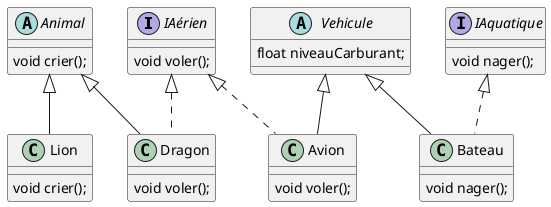

# TD1 : Programmation Orientée Objet (POO)

## Q1 : Qu'est-ce que la POO ?

<article>
La POO est un paradigme de programmation qui repose sur la notion d'objets. Un objet est une instance d'une classe, qui regroupe des données (attributs) et des comportements (méthodes).

</article>

## Q2 : Comment crée-t-on un objet en Java ?
<article>
Pour créer un objet en Java, on utilise le mot-clé `new` suivi du nom de la classe. Par exemple : `Personne p = new Personne("PICOT", "Alexis", 28);`
</article>

## Q3 : Qu'est-ce qu'un constructeur en Java ?
<article>
Un constructeur est une méthode spéciale d'une classe qui est appelée lors de la création d'un objet. Il initialise les attributs de l'objet.
</article>

## Q4 : Quels sont les modificateurs d'accès en Java ?
<article>
Les modificateurs d'accès en Java sont : `public`, `protected`, `private`, et `default` (aucun mot-clé).
</article>

## Q5 : Qu'est-ce que l'encapsulation ?
<article>
L'encapsulation est un concept de la POO qui consiste à cacher les détails internes d'une classe et à ne fournir qu'une interface publique pour interagir avec cette classe.
</article>

## Q6 : Comment accède-t-on aux attributs privés d'une classe ?
<article>
On accède aux attributs privés d'une classe en utilisant des méthodes publiques appelées accesseurs (getters) et mutateurs (setters).
</article>

## Q7 : Donnez un exemple de méthode getter et setter en Java.
<article>

```java
class Personne {
    private String nom;
    private int age;

    public String getNom() {
        return nom;
    }

    public void setNom(String nom) {
        this.nom = nom;
    }

    public int getAge() {
        return age;
    }

    public void setAge(int age) {
        this.age = age;
    }
}
```
</article>

## Q8 : Qu'est-ce que la composition en POO ?
<article>
La composition est un principe de la POO qui consiste à créer des objets complexes en combinant des objets plus simples. Une classe peut avoir des instances d'autres classes comme attributs.
</article>

## Q9 : Donnez un exemple de composition en Java.
<article>

```java
class Moteur {
    void demarrer() {
        System.out.println("Moteur démarré");
    }
}

class Voiture {
    private Moteur moteur;

    Voiture() {
        moteur = new Moteur();
    }

    void conduire() {
        moteur.demarrer();
        System.out.println("Voiture en marche");
    }
}
```
</article>

## Q10 : Quelle est la différence entre héritage et composition ?
<article>
L'héritage permet de créer une nouvelle classe à partir d'une classe existante en héritant de ses attributs et méthodes. La composition consiste à créer des objets complexes en combinant des objets plus simples.
</article>

## Q11 : Qu'est-ce qu'une classe abstraite ?
<article>
Une classe abstraite est une classe qui ne peut pas être instanciée et qui peut contenir des méthodes abstraites (sans implémentation) que les classes dérivées doivent implémenter.
</article>

## Q12 : Donnez un exemple de classe abstraite en Java.

<article>
```java
abstract class Forme {
    abstract double calculerSurface();
}

class Cercle extends Forme {
    double rayon;

    Cercle(double rayon) {
        this.rayon = rayon;
    }

    double calculerSurface() {
        return Math.PI * rayon * rayon;
    }
}
```
</article>

## Q13 : Qu'est-ce qu'une interface en Java ?
<article>
Une interface en Java est un type de référence qui ne peut contenir que des méthodes abstraites (sans implémentation) et des constantes. Les classes peuvent implémenter des interfaces pour garantir qu'elles fournissent certaines méthodes.
</article>

## Q14 : Donnez un exemple d'interface en Java.
<article>

```java
interface Nageur {
    void nager();
}

class Dauphin implements Nageur {
    public void nager() {
        System.out.println("Le dauphin nage");
    }
}
```
</article>

## Q15 : Quelle est la différence entre une classe abstraite et une interface ?
<article>
Une classe abstraite peut contenir des méthodes avec implémentation et des attributs, tandis qu'une interface ne peut contenir que des méthodes abstraites et des constantes. Une classe peut hériter d'une seule classe abstraite mais peut implémenter plusieurs interfaces.
</article>

## Q16 : Qu'est-ce que le polymorphisme en POO ?
<article>
Le polymorphisme est un concept de la POO qui permet à une méthode de faire différentes choses en fonction de l'objet sur lequel elle est appelée. Il permet d'utiliser une interface ou une classe de base pour référencer des objets de classes dérivées.
</article>

## Q17 : Donnez un exemple de polymorphisme en Java.
<article>

```java
class Animal {
    void crier() {
        System.out.println("Je suis un animal");
    }
}

class Chien extends Animal {
    void crier() {
        System.out.println("Wouaf wouaf");
    }
}

class Chat extends Animal {
    void crier() {
        System.out.println("Miaou miaou");
    }
}

public class Main {
    public static void main(String[] args) {
        Animal a1 = new Chien();
        Animal a2 = new Chat();
        a1.crier(); // Wouaf wouaf
        a2.crier(); // Miaou miaou
    }
}
```
</article>

## Q18 : Qu'est-ce que le mot-clé `super` en Java ?
<article>
Le mot-clé `super` est utilisé pour appeler le constructeur ou les méthodes de la classe mère depuis une classe dérivée.
</article>

## Q19 : Donnez un exemple d'utilisation du mot-clé `super` en Java.
<article>

```java
class Animal {
    void crier() {
        System.out.println("Je suis un animal");
    }
}

class Chien extends Animal {
    void crier() {
        super.crier();
        System.out.println(", Wouaf wouaf");
    }
}
```
</article>

## Q20 : Qu'est-ce que le mot-clé `this` en Java ?
<article>
Le mot-clé `this` est utilisé pour référencer l'objet courant dans une méthode ou un constructeur.
</article>

## Q21 : Donnez un exemple d'utilisation du mot-clé `this` en Java.
<article>

```java
class Personne {
    private String nom;
    private int age;

    Personne(String nom, int age) {
        this.nom = nom;
        this.age = age;
    }
}
```
</article>

## Q22 : Qu'est-ce que la surcharge de méthodes en Java ?
<article>
La surcharge de méthodes en Java consiste à définir plusieurs méthodes avec le même nom mais des paramètres différents dans une même classe.
</article>

## Q23 : Donnez un exemple de surcharge de méthodes en Java.
<article>

```java
class Calculatrice {
    int additionner(int a, int b) {
        return a + b;
    }

    double additionner(double a, double b) {
        return a + b;
    }
}
```
</article>

## Q24 : Est-ce que toutes les classes Java ont un constructeur ?

<article>
Oui, toutes les classes Java ont un constructeur. Si aucun constructeur n'est défini dans une classe, Java fournit un constructeur par défaut sans paramètres.
</article>

## Q25 : Est-ce que je peux avoir plusieurs constructeurs dans une classe Java ?

<article>
Oui, vous pouvez avoir plusieurs constructeurs dans une classe Java. C'est ce qu'on appelle la surcharge de constructeurs.
</article>

## Q26 : Qu'est-ce que le mot-clé `abstract` en Java ?
<article>
Le mot-clé `abstract` en Java est utilisé pour déclarer une classe ou une méthode abstraite. Une classe abstraite ne peut pas être instanciée et une méthode abstraite doit être implémentée par les classes dérivées.
</article>

## Q27 : Donnez un exemple d'utilisation du mot-clé `abstract` en Java.
<article>

```java
abstract class Forme {
    abstract double calculerSurface();
}

class Cercle extends Forme {
    double rayon;

    Cercle(double rayon) {
        this.rayon = rayon;
    }

    double calculerSurface() {
        return Math.PI * rayon * rayon;
    }
}
```
</article>

## Q28 : Qu'est-ce que le mot-clé `interface` en Java ?
<article>
Le mot-clé `interface` en Java est utilisé pour déclarer une interface. Une interface ne peut contenir que des méthodes abstraites et des constantes.
</article>

## Q29 : Donnez un exemple d'utilisation du mot-clé `interface` en Java.
<article>

```java
interface Nageur {
    void nager();
}

class Dauphin implements Nageur {
    public void nager() {
        System.out.println("Le dauphin nage");
    }
}
```
</article>

## Q30 : Qu'est-ce que le mot-clé `implements` en Java ?
<article>
Le mot-clé `implements` en Java est utilisé pour indiquer qu'une classe implémente une interface.
</article>

## Q31 : Donnez un exemple d'utilisation du mot-clé `implements` en Java.
<article>

```java
interface Nageur {
    void nager();
}

class Dauphin implements Nageur {
    public void nager() {
        System.out.println("Le dauphin nage");
    }
}
```
</article>

## Q32 : Qu'est-ce que le mot-clé `extends` en Java ?
<article>
Le mot-clé `extends` en Java est utilisé pour indiquer qu'une classe hérite d'une autre classe.
</article>

## Q33 : Donnez un exemple d'utilisation du mot-clé `extends` en Java.
<article>

```java
class Animal {
    void crier() {
        System.out.println("Je suis un animal");
    }
}

class Chien extends Animal {
    void crier() {
        System.out.println("Wouaf wouaf");
    }
}
```
</article>

## Q34 : Qu'est-ce que le mot-clé `instanceof` en Java ?
<article>
Le mot-clé `instanceof` en Java est utilisé pour vérifier si un objet est une instance d'une classe spécifique.
</article>

## Q35 : Donnez un exemple d'utilisation du mot-clé `instanceof` en Java.
<article>

```java
class Animal {
}

class Chien extends Animal {
}

public class Main {
    public static void main(String[] args) {
        Animal a = new Chien();
        if (a instanceof Chien) {
            System.out.println("C'est un chien");
        }
    }
}
```
</article>

## Q36 : Qu'est-ce que le mot-clé `super` en Java ?
<article>
Le mot-clé `super` en Java est utilisé pour appeler le constructeur ou les méthodes de la classe mère depuis une classe dérivée.
</article>

## Q37 : Donnez un exemple d'utilisation du mot-clé `super` en Java.
<article>

```java
class Animal {
    void crier() {
        System.out.println("Je suis un animal");
    }
}

class Chien extends Animal {
    void crier() {
        super.crier();
        System.out.println(", Wouaf wouaf");
    }
}
```
</article>

## Q38 : Qu'est-ce que le mot-clé `this` en Java ?
<article>
Le mot-clé `this` en Java est utilisé pour référencer l'objet courant dans une méthode ou un constructeur.
</article>

## Q39 : Donnez un exemple d'utilisation du mot-clé `this` en Java.
<article>

```java
class Personne {
    private String nom;
    private int age;

    Personne(String nom, int age) {
        this.nom = nom;
        this.age = age;
    }
}
```
</article>

## Q40 : Je veux coder un avion, un dragon, un bateau et un lion. Quelles classes et interfaces devrais-je créer ?

<article>




</article>
