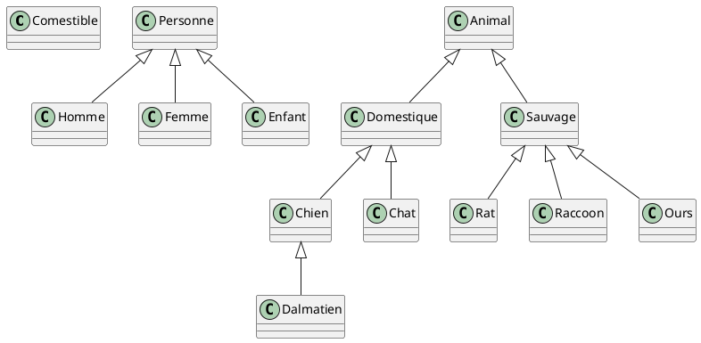
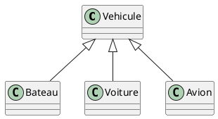
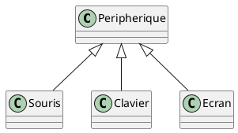
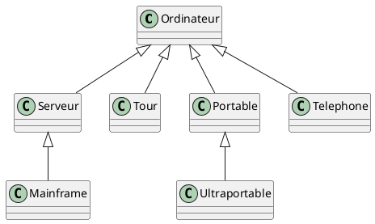
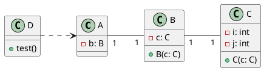

## Classes et visibilité

1. Parmi les appels suivants, indiquez ceux qui sont corrects et ceux qui ne le sont pas :

```{.java}
public class A {
    public int i;
    private int a;
    protected int b;

    public void afficher() {
        System.out.println(i + a + b);
    }
}

public class B extends A {
    public void afficher() {
        System.out.println(i + a + b);
    }
}

public class D {
    public A a = new A();

    public void afficher() {
        System.out.println(a.i + a.a + a.b);
    }
}

public class E {
    public B b = new B();

    public void afficher() {
        b.afficher();
    }
}

public class F {
    public B b = new B();

    public void afficher() {
        System.out.println(b.i + b.a + b.b);
    }
}
```

<article>

> Seules les classes A et E sont fonctionnelles
>
> La classe B ne peut pas accéder à la variable a de la classe A car elle est privée.
>
> La classe D ne peut pas accéder à la variable a de la classe A car elle est privée.
>
> La classe F ne peut pas accéder à la variable a de la classe A car elle est privée.

</article>

2. Ce code compile t-il et, si non, quelle(s) erreur(s) le compilateur va t-il indiquer ?

```java
class Toto {

  int toto = 0;

  Toto() {
    toto = toto + 1;
  }

  public static void main(String[] tutu) {
    Toto t1 = new Toto();
    Toto t2 = new Toto();
    System.out.println("Toto : " + toto);
  }
}

```

<article>

> `Cannot make a static reference to the non-static field toto`
> Le code ne compile pas car la variable toto est privée et ne peut pas être accédée depuis la méthode main.

</article>

3. Le code suivant compilerait t-il ? Il y a t-il une erreur d'exécution, si oui, laquelle ?

```java
class Test {

  int i;

  Test(int i) {
    this.i = 12;
    i = 15;
  }

  void i() {
    Test i = new Test(3);
    System.out.println(i.i);
    i.i();
  }

  public static void main(String[] toto) {
    Test i = new Test(34);
    i.i();
  }
}
```

<article>

> Le code compile mais il y a une erreur d'exécution car la méthode i() appelle elle-même la méthode i() de la classe Test. Cela conduit à une boucle infinie.

</article>

## Relations entre classes

1. Définir les relations entre les classes suivantes :
   - Personne, homme, femme, enfant
   - Animal, chien, chat, ravet, dalmatien, domestique, sauvage, racoon, ours, comestible

<article>


</article>


2. Généraliser :
   - Bateau, voiture, avion

<article>


</article>

2. :
    - Souris, clavier, écran

<article>


</article>

3. Spécialiser :
   - Ordinateur, …

<article>


</article>

4. D'après le code suivant, donnez le diagramme de classe (classes et relations).

```java
public class A {
    public B b;
}

public class B {
    public C c;
    public B(C c) {
        this.c = new C(c);
    }
}

public class C {
    public int i, j;
    public C(C c) {
        this.i = C.i;
        this.j = C.j;
    }
}

public class D {
    void test() {
        B b = new B();
        A a = new A(b);
        A a2 = new A(b);
    }
}
```
<article>


</article>

## Analyse de code

```java
public class Parent {
    int x;
    Parent(int k) {
        x = k;
    }
    int ajoute(int a) {
        return x + a;
    }
    public void moi() {
        System.out.println(" x = " + x);
    }
}
public class Enfant1 extends Parent {
    int y;
    Enfant1(int k, int l) {
        super(k);
        y = l;
    }
    int ajoute(int a) {
        return x + 2 * a;
    }
}
public class Enfant2 extends Enfant1 {
    int z;
    Enfant2(int k, int l, int m) {
        super(k, l);
        z = m;
    }
    int ajoute(int a) {
        return x + 3 * a;
    }
    public void moi() {
        super.moi();
        System.out.println(" z = " + z);
    }
}
public class Essai {
    public static void main(String args[]) {
        int a = 2;
        Parent p = new Parent(3);
        p.moi();
        System.out.println(" ajoute(" + a + ") = " + p.ajoute(a));
        Enfant1 e1 = new Enfant1(3, 4);
        e1.moi();
        System.out.println(" ajoute(" + a + ") = " + e1.ajoute(a));
        e1 = new Enfant2(3, 4, 5);
        e1.moi();
        System.out.println(" ajoute(" + a + ") = " + e1.ajoute(a));
    }
}
```

1. Quels sont les attributs dont disposent les classes Enfant1 et Enfant2 ?

<article>


> Les classes Enfant1 et Enfant2 héritent des attributs de leur classe parente, ainsi que définissent leurs propres attributs spécifiques.
> 
> Voici une analyse des attributs pour chaque classe :
> 
> Classe Enfant1 :
> 
> Hérite de la classe Parent.
> Définit un attribut y.
> Classe Enfant2 :
> 
> Hérite de la classe Enfant1.
> Définit un attribut z.
> Donc :
> 
> Classe Enfant1 dispose d'un attribut y + x de la classe Parent
> Classe Enfant2 dispose d'attributs y hérité de Enfant1, x de Parent et z défini localement dans Enfant2.

</article>

2. Écrivez le résultat de l'exécution de la classe Essai.

<article>
 
```java
 x = 3
 ajoute(2) = 5
 x = 3        
 ajoute(2) = 7
 x = 3        
 z = 5        
 ajoute(2) = 9
 ```
 </article>

## Cours

1. Quelle est la différence entre une classe et un objet ?

<article>


> Une classe et un objet sont deux concepts fondamentaux en programmation orientée objet. Voici la différence entre les deux :
>
> 1. **Classe** :
>    - Une classe est une structure de programmation qui définit un ensemble de propriétés (attributs) et de comportements (méthodes) communs à un ensemble d'objets.
>    - Elle définit le modèle à partir duquel les objets sont créés.
>    - Une classe peut être considérée comme un "plan" ou un "modèle" à partir duquel des objets individuels sont instanciés.
>    - Elle n'existe que dans le code source et ne consomme pas de mémoire lors de l'exécution.
> 
> 2. **Objet** :
>    - Un objet est une instance spécifique d'une classe.
>    - Il représente une occurrence concrète ou particulière d'un concept défini par la classe.
>    - Chaque objet possède un état propre (valeurs des attributs) et peut exécuter des comportements (méthodes) définis dans la classe.
>    - Les objets sont créés à partir d'une classe en utilisant le mot-clé `new`.
>    - Ils existent en mémoire pendant l'exécution du programme.
> 
> En résumé, une classe définit le modèle ou le plan à partir duquel les objets sont créés. Les objets sont des instances spécifiques de cette classe et représentent des entités individuelles avec leurs propres caractéristiques et comportements.

</article>

2. En quoi l’héritage est-il un outil puissant pour le développement d’applications ?

<article>


>L'héritage est un concept clé de la programmation orientée objet qui permet à une classe d'hériter des propriétés et des comportements d'une autre classe. Voici quelques raisons pour lesquelles l'héritage est un outil puissant pour le développement d'applications :
>
>1. **Réutilisation du code** : L'héritage permet de réutiliser le code déjà écrit dans une classe parente. Les sous-classes peuvent hériter des attributs et des méthodes de la classe parente, ce qui évite la duplication du code et favorise une conception modulaire et DRY (Don't Repeat Yourself).
>
>2. **Organisation et structuration du code** : En utilisant l'héritage, vous pouvez organiser votre code de manière hiérarchique et logique. Les classes peuvent être regroupées en classes parentes et sous-classes, reflétant ainsi les relations logiques entre les différentes entités de votre application.
>
>3. **Extensibilité** : L'héritage permet d'étendre les fonctionnalités d'une classe existante en ajoutant de nouveaux comportements ou attributs dans les sous-classes. Cela permet une évolutivité de l'application en ajoutant de nouvelles fonctionnalités sans avoir à modifier le code existant.
>
>4. **Polymorphisme** : L'héritage permet la mise en œuvre du polymorphisme, où des objets de différentes sous-classes peuvent être traités de manière homogène à travers des références de la classe parente. Cela favorise une conception flexible et extensible, permettant de gérer des situations où différentes classes partagent des comportements communs mais implémentent des fonctionnalités spécifiques de manière différente.
>
>5. **Abstraction** : L'héritage permet de créer des classes abstraites qui définissent des comportements génériques sans implémenter tous les détails spécifiques. Ces classes abstraites peuvent ensuite être étendues par des sous-classes concrètes pour implémenter des fonctionnalités spécifiques.
>
>En résumé, l'héritage est un outil puissant qui favorise la réutilisation du code, l'organisation logique du code, l'extensibilité, le polymorphisme et l'abstraction dans le développement d'applications orientées objet. Il contribue à une conception modulaire, flexible et maintenable des applications.


</article>

3. Quelle est la différence entre :

```java
Point p[][] = new Point[5][4];
Point p = new Point(5,4);
```

<article>

> 1. `Point p[][] = new Point[5][4];` : Cette déclaration crée un tableau bidimensionnel de points de taille 5x4. Chaque élément du tableau est une référence à un objet Point, mais les objets Point eux-mêmes ne sont pas encore créés. Le tableau est initialisé avec des valeurs `null` pour chaque élément.
>
> 2. `Point p = new Point(5,4);` : Cette déclaration crée un objet Point avec les coordonnées (5,4). La variable `p` est une référence à cet objet Point nouvellement créé. L'objet Point est instancié et initialisé avec les valeurs spécifiées lors de sa création.
>
> En résumé, la première déclaration crée un tableau bidimensionnel de références à des objets Point, tandis que la deuxième déclaration crée un objet Point spécifique avec des valeurs initiales pour ses attributs.

</article>


4. Expliquez la notion d’Exception en java (fonctionnement, déclaration, …)

<article>

> En Java, une exception est un mécanisme utilisé pour gérer les situations exceptionnelles ou les erreurs qui se produisent pendant l'exécution d'un programme. Cela peut inclure des erreurs de syntaxe, des erreurs de logique, des erreurs d'exécution, des erreurs d'entrée-sortie, etc. Les exceptions permettent de signaler et de gérer ces erreurs de manière ordonnée.
> 
> ### Fonctionnement des exceptions en Java :
> 
> 1. **Déclenchement (throw)** : Une exception est déclenchée lorsqu'une condition anormale se produit dans le code. Cela peut être fait explicitement à l'aide du mot-clé `throw` ou automatiquement par le système lorsqu'une erreur se produit (par exemple, une division par zéro).
> 
> 2. **Propagation (throws)** : Lorsqu'une exception est déclenchée dans une méthode, elle peut être propagée vers le code appelant. Cela peut se faire en ajoutant le mot-clé `throws` à la signature de la méthode pour indiquer que cette méthode peut lancer une exception.
> 
> 3. **Capture (try-catch)** : Pour gérer une exception, vous pouvez utiliser un bloc `try-catch`. Le code potentiellement risqué est placé dans un bloc `try`, et les exceptions qui se produisent à l'intérieur de ce bloc sont capturées et gérées dans un bloc `catch`. Un bloc `catch` contient le code qui est exécuté pour gérer l'exception.
> 
> 4. **Propagation vers le haut (throw)** : Si une exception n'est pas traitée dans le bloc `catch` où elle est capturée, elle peut être propagée vers le code appelant en utilisant le mot-clé `throw`.
> 
> 5. **Gestion finale (finally)** : Un bloc `finally` peut être utilisé pour spécifier un code qui doit être exécuté, qu'une exception soit levée ou non. Cela est utile pour le nettoyage des ressources ou l'exécution de certaines actions de clôture.
> 
> ### Déclaration d'une exception en Java :
> 
> En Java, une exception est généralement déclarée comme une classe qui étend la classe `Throwable`. Les exceptions peuvent être des exceptions vérifiées (héritant de `Exception`) ou des exceptions non vérifiées (héritant de `RuntimeException`).
> 
> Voici comment vous pouvez déclarer et utiliser une exception en Java :
> 
> ```java
> public class MonException extends Exception {
>     public MonException(String message) {
>         super(message);
>     }
> }
> 
> public class Exemple {
>     public void maMethode() throws MonException {
>         // code pouvant générer une exception
>         if (conditionAnormale) {
>             throw new MonException("Une erreur s'est produite !");
>         }
>     }
> 
>     public static void main(String[] args) {
>         try {
>             Exemple exemple = new Exemple();
>             exemple.maMethode();
>         } catch (MonException e) {
>             // Gestion de l'exception
>             System.out.println("Une exception s'est produite : " + e.getMessage());
>         }
>     }
> }
> ```
> 
> Dans cet exemple, `MonException` est une classe d'exception personnalisée qui étend la classe `Exception`. La méthode `maMethode()` déclare qu'elle peut lancer une exception de type `MonException` à l'aide du mot-clé `throws`. Dans la méthode `main()`, nous appelons `maMethode()` à l'intérieur d'un bloc `try-catch` pour gérer toute exception qui pourrait être levée. Si une exception de type `MonException` est levée, elle est capturée dans le bloc `catch` et gérée en conséquence.

</article>
