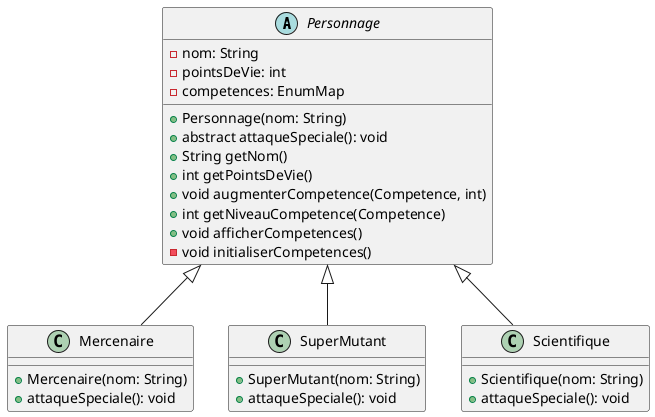

---
produce:
    html: 
        remove_answers: false
---

[TOC]

# Travaux Pratiques : Introduction à la Programmation Orientée Objet en Java - Création d'un RPG

## Introduction

Dans le cadre de ce projet de travaux pratiques, nous allons explorer les bases de la programmation orientée objet (POO) en Java en développant un jeu de rôle (RPG) simple. L'objectif est d'introduire progressivement les concepts fondamentaux de la POO tout en créant un programme que vous pouvez vous approprier pour le rendre plus ou moins intéressant.

## Objectifs

- Comprendre les principes de base de la programmation orientée objet.
- Apprendre à déclarer des variables en Java.
- Utiliser les entrées utilisateur pour interagir avec le programme.
- Afficher des données à l'écran.
- Progresser étape par étape dans la conception et l'implémentation d'un RPG en Java.

## Instructions

### Étape 1 : Déclaration de variables et saisie du nom du personnage

Dans cette première étape, vous allez créer un programme Java simple qui permet à l'utilisateur de saisir le nom de son personnage pour un jeu de rôle (RPG) et d'afficher ce nom à l'écran.

**Instructions :**

1. Démarrez votre environnement de développement Java.
2. Créez une nouvelle classe Java appelée "PersonnageRPG".
3. Dans la classe "PersonnageRPG", déclarez une variable de type String pour stocker le nom du personnage.
4. À l'intérieur de la méthode principale (main), utilisez un objet Scanner pour permettre à l'utilisateur de saisir le nom de son personnage.
5. Affichez ensuite le nom du personnage à l'écran.

**Exemple de code :**

```java
import java.util.Scanner;

public class PersonnageRPG {
    public static void main(String[] args) {
        // Déclaration de la variable pour stocker le nom du personnage
        String nomPersonnage;

        // Création d'un objet Scanner pour la saisie utilisateur
        Scanner scanner = new Scanner(System.in);

        // Demande à l'utilisateur de saisir le nom du personnage
        System.out.print("Entrez le nom de votre personnage : ");
        nomPersonnage = scanner.nextLine();

        // Affiche le nom du personnage à l'écran
        System.out.println("Le nom de votre personnage est : " + nomPersonnage);

        // Ferme le scanner
        scanner.close();
    }
}
```

> N'hésitez pas à vous familiariser avec l'auto-complétion et à appréhender votre IDE. Le Java est un langage assez verbeux, de plus nous allons *à outrance* faire des choses répétitives pour aborder les concepts. Si vous découvrez comment tirer profit de l'outil au maximum et que vous comprenez ce qu'il se passe, vous pourriez gagner un temps précieux.

**Conseils :**
- Familiarisez-vous avec les points d'arrêt si vous les découvrez.
- [Run and Debug Java in Visual Studio Code](https://code.visualstudio.com/docs/java/java-debugging)

6. Faites en sorte que l'utilisateur soit invité à saisir un nom à son personnage tant que la longueur de la variable nom est inférieure à 3.

### Étape 2 : Création de nouvelles variables pour les caractéristiques du personnage

Dans cette étape, vous allez créer de nouvelles variables pour représenter les caractéristiques principales de votre personnage dans un RPG, telles que la force, l'agilité et l'intelligence. Vous utiliserez un switch case pour choisir quelles caractéristiques augmenter à l'aide des points de compétence.

**Instructions :**

1. Ajoutez trois nouvelles variables de type int dans votre classe "PersonnageRPG" pour représenter la force, l'agilité et l'intelligence du personnage.
2. Initialisez ces variables à zéro au début du programme.
3. Demandez à l'utilisateur de répartir 25 points de compétence entre ces caractéristiques en utilisant un switch case pour choisir quelle caractéristique augmenter.
4. Assurez-vous que le total des points attribués ne dépasse pas 25.
5. Si le total des points attribués est négatif ou dépasse 25, lancez une exception pour indiquer une erreur.

**Conseils :**

- Assurez-vous de comprendre comment fonctionne le switch case pour gérer différents choix de l'utilisateur.
- Utilisez des conditions (if/else) pour vérifier si les points attribués sont valides et pour lancer des exceptions si nécessaire.
- Testez votre programme avec différentes répartitions de points pour vous assurer qu'il fonctionne correctement.

6. Équilibrez votre jeu, on veut éviter que le personnage soit une brute avec 25 de force et 0 en agilité et intelligence. On veut un minimum de 3 points dans chaque compétence et pas plus de 15 points par compétence. Vous avez deux solutions : soit vous initialisez les variables à 3 et vous considérez qu'il n'y a plus que 16 points à attribuer, soit vous faites en sorte que l'utilisateur choisisse un chiffre compris entre 3 et 15 en lui affichant un message en cas de saisie incorrecte. On préfèrera la deuxième option car elle vous apprend à lever une exception :
`throw new IllegalArgumentException("L'agilité doit être entre 3 et 15.");`

7. Votre code ressemble à ça au moment d'attribuer les points :

```java
// ...existing code...
// Répartition des points de compétence
int pointsRestants = 25;
while (pointsRestants > 0) {
    System.out.println("Points restants à répartir : " + pointsRestants);
    System.out.println("1. Augmenter la force");
    System.out.println("2. Augmenter l'agilité");
    System.out.println("3. Augmenter l'intelligence");
    System.out.print("Choisissez une caractéristique à améliorer (1-3) : ");
    int choix = scanner.nextInt();

    switch (choix) {
        case 1:
            System.out.print("Combien de points voulez-vous ajouter à la force : ");
            int pointsForceAAttribuer = scanner.nextInt();
            if (pointsForceAAttribuer > pointsRestants) {
                throw new IllegalArgumentException("Le nombre de points attribués est supérieur au nombre de points restants");
            }
            int nouveauSoldePointForce = force + pointsForceAAttribuer;
            if (nouveauSoldePointForce < 3 || nouveauSoldePointForce > 15) {
                throw new IllegalArgumentException("Le nombre de points n'est pas compris entre 3 et 15");
            }
            force = nouveauSoldePointForce;
            pointsRestants -= pointsForceAAttribuer;
            break;
        // ...existing code...
    }
    // ...existing code...
}
```

>Lancez le programme et essayez d'attribuer 20 points d'agilité, vous aurez l'erreur suivante :

8. Adaptez votre code pour introduire `try{} catch{}`. Exemple :

```java
while (pointsRestants > 0) {
    try {
        System.out.println("Points restants à répartir : " + pointsRestants);
        System.out.println("1. Augmenter la force");
        System.out.println("2. Augmenter l'agilité");
        System.out.println("3. Augmenter l'intelligence");
        System.out.print("Choisissez une caractéristique à améliorer (1-3) : ");
        int choix = scanner.nextInt();

        switch (choix) {
            case 1:
                // Reste du code
                throw new IllegalArgumentException("Le nombre de points n'est pas compris entre 3 et 15");
            break;
        }
    } catch (Exception e) {
        System.err.println("\033[0;31m" + e.getMessage() + "\033[0m");
    }
}
```

> Ne prêtez pas trop attention aux caractères bizarres dans le catch. Cela permet de changer la couleur de la console pour afficher l'erreur en rouge.

Ainsi, lorsque vous ferez une mauvaise saisie, le message d'erreur s'affichera et vous devrez recommencer jusqu'à avoir correctement attribué tous vos points.

>**Vous remarquez que le code commence à devenir répétitif pour 4 pauvres variables. On va alors essayer de transformer ce code en programme orienté objet.**

### Étape 3 : Création de la classe `Personnage`

1. Créez une nouvelle classe `Personnage` dans le fichier `Personnage.java` qui contiendra les attributs et les méthodes pour représenter un personnage dans le RPG.

```java
public class Personnage {
    private String nom;
    private int force;
    private int agilite;
    private int intelligence;

    // Constructeur
    public Personnage(String nom) {
        this.nom = nom;
        this.force = 0;
        this.agilite = 0;
        this.intelligence = 0;
    }

    // Getters
    public String getNom() {
        return nom;
    }

    public int getForce() {
        return force;
    }

    public int getAgilite() {
        return agilite;
    }

    public int getIntelligence() {
        return intelligence;
    }

    // Setters avec vérifications

    public void augmenterIntelligence(int intelligenceAAjouter) {
        int nouvelleIntelligence = intelligenceAAjouter + intelligence;
        if (nouvelleIntelligence < 3 || nouvelleIntelligence > 15) {
            throw new IllegalArgumentException("L'intelligence doit être entre 3 et 15.");
        }
        this.intelligence = nouvelleIntelligence;
    }
    // ... Faites pareil pour Agilité et Force
}
```

#### Étape 3.1 : Utilisation de la classe `Personnage` dans le programme principal

Dans votre programme principal, utilisez la classe `Personnage` pour créer un personnage et utilisez ses méthodes pour accéder et modifier ses caractéristiques.

```java
import java.util.Scanner;

public class Main {
    public static void main(String[] args) {
        Scanner scanner = new Scanner(System.in);

        // Demande à l'utilisateur de saisir le nom du personnage (au moins 3 caractères)
        String nomPersonnage = "";
        while (nomPersonnage.length() < 3) {
            System.out.print("Entrez le nom de votre personnage (au moins 3 caractères) : ");
            nomPersonnage = scanner.nextLine();
        }

        // Création d'un objet Personnage
        Personnage personnage = new Personnage(nomPersonnage);

        // Répartition des points de compétence
        int pointsRestants = 25;
        while (pointsRestants > 0) {
            try {
                System.out.println("Points restants à répartir : " + pointsRestants);
                System.out.println("1. Augmenter la force");
                System.out.println("2. Augmenter l'agilité");
                System.out.println("3. Augmenter l'intelligence");
                System.out.print("Choisissez une caractéristique à améliorer (1-3) : ");
                int choix = scanner.nextInt();

                switch (choix) {
                    case 1:
                        System.out.print("Combien de points voulez-vous ajouter à la force (entre 3 et 15) : ");
                        int pointsForceAAttribuer = scanner.nextInt();
                        personnage.augmenterForce(pointsForceAAttribuer);
                        pointsRestants -= pointsForceAAttribuer;
                        break;
                    case 2:
                        System.out.print("Combien de points voulez-vous ajouter à l'agilité (entre 3 et 15) : ");
                        int pointsAgiliteAAttribuer = scanner.nextInt();
                        personnage.augmenterAgilite(pointsAgiliteAAttribuer);
                        pointsRestants -= pointsAgiliteAAttribuer;
                        break;
                    case 3:
                        System.out.print("Combien de points voulez-vous ajouter à l'intelligence (entre 3 et 15) : ");
                        int pointsIntelligenceAAttribuer = scanner.nextInt();
                        personnage.augmenterIntelligence(pointsIntelligenceAAttribuer);
                        pointsRestants -= pointsIntelligenceAAttribuer;
                        break;
                    default:
                        System.out.println("Choix invalide, veuillez choisir une option valide !");
                }
            } catch (Exception e) {
                System.err.println("\033[0;31m" + e.getMessage() + "\033[0m");
            }
        }

        // Affichage des caractéristiques du personnage
        System.out.println("Nom du personnage : " + personnage.getNom());
        System.out.println("Force : " + personnage.getForce());
        System.out.println("Agilité : " + personnage.getAgilite());
        System.out.println("Intelligence : " + personnage.getIntelligence());

        scanner.close();
    }
}
```

> Vous remarquez une erreur en compilant votre code. En Java, le nom du fichier doit respecter le nom de la classe qu'il contient et il ne doit y avoir qu'une seule classe par fichier. Vous remarquez que la petite ampoule 💡 vous propose de corriger ça à votre place.

**Observations :**

- La classe `Personnage` encapsule maintenant les données et les opérations liées à un personnage, améliorant ainsi la lisibilité et la maintenance du code.
- Les vérifications des valeurs des caractéristiques sont désormais effectuées dans les setters de la classe `Personnage`, ce qui renforce le principe d'encapsulation et garantit l'intégrité des données.

### Étape 4 : Ajout de compétences au personnage

Dans cette étape, vous allez étendre les caractéristiques du personnage en ajoutant des compétences telles que la perception, l'endurance, le charisme et la chance. Au lieu de créer des getters et des setters pour chaque compétence, vous allez stocker ces informations dans un dictionnaire pour simplifier votre code.

**Instructions :**

1. Ajoutez les compétences suivantes : Perception, Endurance, Charisme, et Chance, en plus des caractéristiques déjà existantes. Pour cela, créez un fichier `Competence.java` et ajoutez le code suivant :

```java
enum Competence {
    FORCE, PERCEPTION, ENDURANCE, CHARISME, INTELLIGENCE, AGILITE, CHANCE;
}
```

2. Nous allons introduire une nouvelle variable que vous ne connaissez pas : `EnumMap`. EnumMap est un dictionnaire dont les clés font partie d'une énum. En gros, vous pouvez l'imaginer comme un tableau, la première colonne contient les noms de compétences et la deuxième ce que vous voulez. Toutefois, vous ne voulez pas qu'on puisse écrire n'importe quoi dans ce tableau. Par exemple `enumMap.put(Competences.FORCE, 1);` c'est OK mais on ne pourra pas écrire `enumMap.put("toto",1)`.

3. Dans la classe `Personnage`, créez une méthode `augmenterCompetence` pour augmenter le niveau d'une compétence spécifique en vérifiant que la nouvelle valeur est comprise entre 3 et 15.

4. Utilisez des exceptions pour signaler une erreur si l'utilisateur entre une valeur incorrecte lors de l'augmentation d'une compétence.

5. Vous pouvez vous débarrasser de `augmenterForce`, `augmenterAgilite` et `augmenterIntelligence`.

À ce stade, votre classe Personnage ressemble à ceci :

```java
import java.util.EnumMap;
import java.util.Map;

public class Personnage {
    private String nom;
    private Map<Competence, Integer> competences;

    // Constructeur
    public Personnage(String nom) {
        this.nom = nom;
        this.competences = new EnumMap<>(Competence.class);
        // Initialisation des compétences avec des valeurs par défaut
        initialiserCompetences();
    }

    // Méthode privée pour initialiser les compétences avec des valeurs par défaut
    private void initialiserCompetences() {
        for (Competence competence : Competence.values()) {
            competences.put(competence, 0);
        }
    }

    // Méthode pour augmenter le niveau d'une compétence
    public void augmenterCompetence(Competence competence, int points) {
        // Effectuez les vérifications nécessaires
        int nouveauNiveau = competences.get(competence) + points;
        if (nouveauNiveau < 3 || nouveauNiveau > 15) {
            throw new IllegalArgumentException("Le niveau de la compétence doit être entre 3 et 15.");
        }
        competences.put(competence, nouveauNiveau);
    }

    public int getNiveauCompetence(Competence competence) {
        return competences.get(competence);
    }

    // Méthode pour afficher les compétences du personnage
    public void afficherCompetences() {
        System.out.println("Compétences de " + nom + " :");
        for (Competence competence : Competence.values()) {
            System.out.println(String.format("%-10s \t niveau : %d", competence, getNiveauCompetence(competence)));
        }
    }
}
```

Dans votre code principal :

```java
// ...existing code...
// Répartition des points de compétence
int pointsRestants = 25;
while (pointsRestants > 0) {
    System.out.println("Points restants à répartir : " + pointsRestants);
    System.out.println("Choisissez une compétence à améliorer : ");
    for (int index = 0; index < Competence.values().length; index++) {
        System.out.println(String.format("%d. %s", index + 1, Competence.values()[index]));
    }

    Integer choixCompetence = scanner.nextInt();
    if (choixCompetence < 1 || choixCompetence > Competence.values().length) {
        throw new IllegalArgumentException("Veuillez choisir un nombre entre 1 et " + Competence.values().length);
    }

    Competence competenceAAugmenter = Competence.values()[choixCompetence - 1];
    System.out.print("Combien de points voulez-vous ajouter à " + competenceAAugmenter + " (entre 3 et 15) : ");
    int pointsCompetence = scanner.nextInt();

    try {
        personnage.augmenterCompetence(competenceAAugmenter, pointsCompetence);
        pointsRestants -= pointsCompetence;
    } catch (IllegalArgumentException e) {
        System.err.println("\033[0;31m" + e.getMessage() + "\033[0m");
    }
}
```

**Conseils :**

- Utilisez un dictionnaire pour stocker les compétences afin de simplifier la gestion des données et de rendre votre code plus flexible.
- Utilisez des exceptions pour gérer les erreurs lors de l'augmentation des compétences, en veillant à ce que les valeurs soient comprises entre 3 et 15.

**Illustration de l'avantage de l'encapsulation :**

L'encapsulation permet de regrouper les données (les compétences du personnage) et les méthodes qui agissent sur ces données (augmenter le niveau d'une compétence) dans une seule entité, la classe `Personnage`. Cela rend le code plus modulaire, plus facile à comprendre et à maintenir. De plus, en encapsulant les données, nous pouvons garantir leur intégrité et empêcher l'accès direct et non autorisé à ces données de l'extérieur de la classe. Dans notre exemple, si votre personnage gagne un niveau, vous n'aurez qu'à appeler la méthode `augmenterCompetence` et vous n'aurez pas à refaire toutes les vérifications. Aussi, il est impossible sans modifier la classe Personnage de changer la limite de 15 points de compétences. C'est un aspect fondamental en termes de sécurité. Imaginez que votre seule mission est de créer une librairie avec la classe Personnage et que d'autres personnes peuvent créer un jeu, vous êtes assurés qu'ils ne pourront pas la modifier et que le niveau maximum sera toujours de 15.

### Étape 5 : Mise en place des tests unitaires

Dans cette étape, vous allez apprendre à écrire des tests unitaires pour vérifier le bon fonctionnement de votre classe `Personnage`. Les tests unitaires sont une pratique courante en programmation pour s'assurer que chaque composant d'un programme fonctionne correctement de manière isolée.

#### Instructions :

1. **Création d'un fichier de test :**

    Dans le répertoire `src/test/java`, créez un fichier de test pour la classe `Personnage`. Par exemple, créez un fichier `PersonnageTest.java`.

2. **Écriture des tests unitaires :**

    Voici un exemple de test unitaire pour la classe `Personnage` :

    ```java
    import org.junit.Test;
    import static org.junit.Assert.*;

    public class PersonnageTest {

        @Test
        public void testAugmenterCompetence() {
            Personnage personnage = new Personnage("Test");
            personnage.augmenterCompetence(Competence.FORCE, 5);
            assertEquals(5, personnage.getNiveauCompetence(Competence.FORCE));
        }

        @Test(expected = IllegalArgumentException.class)
        public void testAugmenterCompetenceInvalide() {
            Personnage personnage = new Personnage("Test");
            personnage.augmenterCompetence(Competence.FORCE, 20);
        }

        @Test
        public void testNomPersonnage() {
            Personnage personnage = new Personnage("Test");
            assertEquals("Test", personnage.getNom());
        }
    }
    ```

3. **Exécution des tests :**

    Pour exécuter les tests, utilisez la commande suivante dans le terminal à la racine de votre projet :

    ```bash
    gradle test
    ```

    Gradle exécutera les tests et affichera les résultats dans le terminal.

#### Conseils :

- Écrivez des tests pour chaque méthode de votre classe `Personnage` pour vous assurer qu'elles fonctionnent correctement.
- Testez les cas normaux ainsi que les cas d'erreur pour vérifier que les exceptions sont correctement levées.
- Utilisez les assertions (`assertEquals`, `assertTrue`, `assertFalse`, etc.) pour vérifier les résultats attendus.

> À partir de maintenant, vous devriez écrire des tests unitaires pour chaque nouvelle fonctionnalité que vous ajoutez à votre programme. Cela vous permettra de détecter rapidement les erreurs et de garantir que votre code fonctionne correctement.

### Étape 6 : Implémentation de classes de personnages spécialisées

Dans cette étape, vous allez implémenter des classes de personnages spécialisées. Vous utiliserez l'héritage pour créer ces classes et surchargerez la méthode `attaqueSpeciale()` pour chaque type de personnage.

#### Instructions :

1. Utilisez le diagramme de classes suivant comme guide pour créer les classes de personnages spécialisées :



1. Transformez votre classe `Personnage` en une classe abstraite avec les attributs et les méthodes communs à tous les personnages.
2. Ajouter une méthode `public abstract void attaqueSpeciale();`
3. Créez des classes spécialisées `Mercenaire`, `SuperMutant` et `Scientifique` en héritant de la classe `Personnage`.
4. Surchargez la méthode `attaqueSpeciale()` dans chaque classe spécialisée pour définir le comportement de l'attaque spéciale de chaque type de personnage.
5. Testez vos classes en créant des instances de chaque type de personnage et en appelant la méthode `attaqueSpeciale()`.
6. Dans le constructeur, appelez la méthode `super()` pour appeler le constructeur parent qui est censé initialiser les compétences à 0. Après l'initialisation, dans la classe enfant, ajoutez par exemple `augmenterCompetence(Competence.AGILITE, 5);` ainsi chaque classe de personnage a un avantage par rapport aux autres.

#### Conseils :

- Pour créer une classe avec héritage, utilisez le mot-clé `extends` suivi du nom de la classe parente.
- Pour surcharger une méthode, déclarez une méthode avec la même signature dans la classe enfant, mais avec une implémentation différente.

```java
// Classe Mercenaire
class Mercenaire extends Personnage {
    // Constructeur
    public Mercenaire(String nom) {
        super(nom);
        augmenterCompetence(Competence.AGILITE, 5);
        // Mettez la compétence de votre choix pour illustrer
    }

    // Attaque spéciale du mercenaire
    @Override
    public void attaqueSpeciale() {
        System.out.println(getNom() + " utilise son attaque spéciale : Tir de précision !");
    }
}
```

### Étape 7 : Utilisation du polymorphisme

Dans l'étape 7, nous allons montrer comment tirer profit du polymorphisme en utilisant les classes spécialisées `Mercenaire`, `SuperMutant`, et `Scientifique` dans notre programme principal. Voici un exemple de code :

```java
public class Main {
    public static void main(String[] args) {
        // Création d'une liste de personnages
        List<Personnage> personnages = new ArrayList<>();
        
        // Ajout de différents types de personnages à la liste
        personnages.add(new Mercenaire("John"));
        personnages.add(new SuperMutant("Gronk"));
        personnages.add(new Scientifique("Dr. Smith"));
        
        // Boucle sur la liste des personnages pour les faire attaquer
        for (Personnage personnage : personnages) {
            System.out.println("Nom du personnage : " + personnage.getNom());
            personnage.attaqueSpeciale();
            personnage.afficherCompetences();
            System.out.println(); // Saut de ligne pour la lisibilité
        }
    }
}
```

Dans ce code, nous utilisons une liste de type `Personnage` pour stocker différents types de personnages : `Mercenaire`, `SuperMutant`, et `Scientifique`. Lorsque nous parcourons la liste des personnages, nous appelons la méthode `attaqueSpeciale()`.

Grâce au polymorphisme, l'appel à `attaqueSpeciale()` sur chaque objet de la liste déclenchera l'implémentation spécifique de cette méthode dans la classe concrète à laquelle l'objet appartient. Cela nous permet d'appeler la méthode appropriée pour chaque type de personnage sans avoir à connaître le type exact à l'avance, ce qui rend notre code plus flexible et extensible.

### Étape 8 : Ajout d'armes et d'armures au personnage

Dans cette étape, nous allons étendre la classe `Personnage` pour lui permettre de porter des armes et des armures. Nous allons également créer des classes pour les armes et les armures, qui hériteront d'une classe abstraite `Item`.

#### Instructions :

1. Créez une classe abstraite `Item` avec trois attributs : `description` de type String, `poids` de type double et `prix` de type double.
2. Ajoutez deux sous-classes **abstraites** de `Item` : `Arme` et `Armure`.
3. La classe `Arme` doit avoir un attribut supplémentaire `degats` de type int, représentant les dégâts infligés par l'arme.
4. La classe `Armure` doit avoir un attribut supplémentaire `protection` de type int, représentant le niveau de protection fourni par l'armure.
5. Modifiez la classe `Personnage` pour lui permettre de porter une arme et/ou une armure. Ajoutez les méthodes `equiperArme()` et `equiperArmure()` pour cela.
6. Testez vos classes en créant des classes dérivées d'armes et d'armures et quelques instances, en les équipant à un personnage, et en simulant des interactions de combat.

À la fin de cette étape, votre classe `Personnage` devrait être capable de porter des armes et des armures, ce qui ajoutera une dimension tactique intéressante à votre RPG.

### Étape 9 : Gestion de l'inventaire

Dans cette étape, nous allons nous concentrer sur la gestion de l'inventaire dans notre jeu RPG, en utilisant les classes Collection de Java pour stocker les objets et en introduisant les interfaces et les comparateurs pour enrichir cette fonctionnalité.

#### Partie théorique : Interfaces et comparateurs en Java

Avant de commencer à coder, examinons brièvement deux concepts clés que nous allons utiliser :

- **Interfaces en Java :** Une interface est un contrat que les classes peuvent choisir de remplir en implémentant ses méthodes. Cela permet de définir un ensemble de comportements sans spécifier comment ils doivent être implémentés. Dans notre cas, nous allons créer une interface `IValuable` avec une méthode `aPourValeur` pour représenter la valeur des objets.

- **Comparateurs en Java :** Les comparateurs sont des objets qui définissent un ordre total sur des objets. Ils sont utilisés pour trier des collections d'objets selon certains critères. Nous allons créer des comparateurs pour trier les objets de l'inventaire en fonction de leur prix, leur poids et leur valeur.

Maintenant que nous avons une compréhension de base de ces concepts, passons à la mise en pratique.

#### Ressources supplémentaires :

- [Interface en Java (Oracle Documentation)](https://docs.oracle.com/javase/tutorial/java/concepts/interface.html)
- [Comparateurs en Java (Oracle Documentation)](https://docs.oracle.com/javase/8/docs/api/java/util/Comparator.html)

#### Instructions :

1. **Création de l'interface `IValuable` :**

    Implémentez une interface `IValuable` avec une méthode `aPourValeur` qui renvoie la valeur de l'objet. Cette interface sera utilisée pour définir le comportement des objets ayant une valeur dans notre jeu.
    [!CAUTION] Je ne parle pas de la valeur "prix" mais pour une arme ce sera ses dégâts et pour une protection son niveau de protection.

2. **Utilisation de l'interface dans la classe `Item` :**

    Dans la méthode `toString` de la classe `Item`, utilisez l'opérateur `instanceof` pour vérifier si l'objet implémente l'interface `IValuable`. Si c'est le cas, affichez la valeur de l'objet.

3. **Méthode `ajouterALInventaire` :**

    Implémentez une méthode `ajouterALInventaire` qui ajoute un objet à l'inventaire. Utilisez une collection de type `Set` pour stocker les objets uniques, en évitant les doublons.

4. **Affichage de l'inventaire :**

    Implémentez une méthode `afficherInventaire` qui utilise les Streams pour grouper les objets de l'inventaire par le nom de leur classe. Présentez l'introspection en expliquant comment cela permet d'accéder aux métadonnées des classes à l'exécution.

5. **Menu de sélection d'affichage :**

    Créez un menu interactif qui permet aux joueurs de choisir quelle page d'inventaire ils veulent voir. Utilisez les méthodes `System.out.println` pour afficher les options et la classe `Scanner` pour lire l'entrée de l'utilisateur.

6. **Implémentation des comparateurs :**

    Créez des comparateurs pour trier les objets en fonction de leur prix, leur poids et leur valeur. Utilisez les interfaces `Comparator` pour définir ces comparateurs.

7. **Tri de l'inventaire :**

    Dans le menu de sélection, permettez aux joueurs de choisir le type de tri qu'ils veulent appliquer à leur inventaire en tapant une lettre suivie d'un numéro correspondant au type de comparateur.
    > Vous pouvez utiliser la méthode `Collections.sort` pour trier les objets en utilisant les comparateurs.
    Vous pouvez également utiliser les Streams pour trier les objets en fonction de leur valeur (dégâts ou protection), de leur poids ou de leur prix.
    Pour cela, stockez les comparateurs dans des variables et utilisez-les ainsi :
    ```java
    Collections.sort(inventaire, comparateur);
    ```

En suivant ces étapes, vous allez enrichir votre jeu RPG en permettant aux joueurs de gérer efficacement leur inventaire et de personnaliser leur expérience de jeu en fonction de leurs besoins et préférences.

### Étape 10 : Niveau d'expérience et Points de vie

Avant de passer à la création du système d'exploration, nous allons ajouter deux nouvelles fonctionnalités importantes à notre jeu : un niveau d'expérience pour le personnage et des points de vie.

#### Instructions :

1. **Ajout du niveau d'expérience :**

    Ajoutez un attribut `niveauExperience` à la classe `Personnage` pour suivre le niveau d'expérience du personnage.

2. **Ajout des points de vie :**

    Ajoutez une méthode `getPointsDeVie` à la classe `Personnage` pour représenter les points de vie du personnage.
    Dans un premier temps, le personnage ne perd pas définitivement ses points de vie mais il les récupère à chaque fois qu'il est blessé à l'issue d'un combat.
    En l'occurrence, c'est plutôt "points de vie max" que vous allez implémenter.
    Faites que la méthode renvoie `100 + Force * 10`.

### Étape 11 : Création du système d'exploration

Maintenant que nous avons enrichi notre personnage, nous allons créer un système d'exploration pour lui permettre de vivre des aventures excitantes et dangereuses !

#### Classe ExplorationGenerator

1. **Création de la classe ExplorationGenerator :**

    Créez une nouvelle classe `ExplorationGenerator` qui exposera une méthode `explorer(Personnage)`. Cette méthode permettra au personnage de découvrir de nouveaux endroits et d'interagir avec ce qu'il y trouve.

2. **Méthode `explorer` :**

    Dans la méthode `explorer`, générez un nombre aléatoire. Sur une chance sur 4, appelez la méthode `looterUnObjet()`, sinon appelez la méthode `combat()`.

3. **Méthode `combat` :**

    La méthode `combat` devra être définie dans l'interface `ICombatGenerator`. Elle prendra en paramètre le personnage et renverra un boolean indiquant le résultat du combat (victoire ou défaite).

4. **Méthode `looterUnObjet` :**

    La méthode `looterUnObjet` devra être définie dans l'interface `ILootGenerator`. Elle prendra également en paramètre le personnage et renverra un objet `Item`.

5. **Gestion de la victoire :**

    Si le résultat du combat est `true`, c'est-à-dire que le personnage a remporté le combat, il y a une chance sur 2 d'appeler la méthode `looterUnObjet`. Dans tous les cas, le personnage gagnera de l'expérience.

6. **Interfaces pour la génération :**

    Stockez une référence vers une instance des interfaces `ILootGenerator`, `ICombatGenerator` et `IExperienceGenerator`. Ces interfaces prennent en paramètre un personnage et renvoient respectivement un objet `Item`, un boolean et un entier.

#### Interfaces pour la génération de loot, de combat et d'expérience

Voici les interfaces et les classes concrètes pour générer du loot, gérer les combats et calculer l'expérience gagnée par le personnage.

##### Interface ILootGenerator :

```java
public interface ILootGenerator {
    Item genererLoot();
}
```

##### Interface ICombatGenerator :

```java
public interface ICombatGenerator {
    boolean combat(Personnage personnage);
}
```

##### Interface IExperienceGenerator :

```java
public interface IExperienceGenerator {
    int calculerExperience(Personnage personnage);
}
```

#### Implémentations des classes :

##### LootGenerator :

```java
import java.util.Random;

public class LootGenerator implements ILootGenerator {
    private Random random;

    public LootGenerator() {
        this.random = new Random();
    }

    @Override
    public Item genererLoot() {
        int choix = random.nextInt(6); // Génère un nombre aléatoire entre 0 et 5
        // Vous pouvez vous amuser à rendre les équipements plus durs à obtenir que d'autres, vous pouvez fonctionner avec des plages de valeurs. Exemple : si <50 loot pourri, si <60 moyen, si <70 bon loot, etc. Par contre, il ne sera pas possible d'utiliser un switch case.

        switch (choix) {
            case 0:
                return new ArmureCuir();
            case 1:
                return new ArmureTissu();
            case 2:
                return new ArmureMetal();
            case 3:
                return new ArmureCombat();
            case 4:
                return new ArmureEnergetique();
            case 5:
                return new ArmureAssault();
            default:
                // En cas de choix invalide, retourne null
                return null;
        }
    }
}
```

##### CombatGenerator :

```java
public class CombatGenerator implements ICombatGenerator {
    private Random random;

    public CombatGenerator() {
        this.random = new Random();
    }

    @Override
    public boolean combat(Personnage personnage) {
        // Points de vie du monstre entre 50 et 100
        int pointsDeViePersonnage = personnage.getPointsDeVie();

        int pointsDeVieMonstre = pointsDeViePersonnage * random.nextDouble(0.9,1.2); // Points de vie du monstre entre 90 et 120% de ceux du personnage
    
        do {
            // Calcul des dégâts infligés par le personnage et le monstre
            int degatsPersonnage = personnage.getDegats() + random.nextInt(11); // Dégâts entre 0 et 10 supplémentaires
            int degatsMonstre = degatsPersonnage * random.nextDouble(0.9,1.2); // Dégâts du monstre entre 90 et 120% de ceux du personnage

            // Appliquer les dégâts
            pointsDeVieMonstre -= degatsPersonnage;
            pointsDeViePersonnage -= degatsMonstre;

            // Vérifier si le combat est terminé
            if (pointsDeVieMonstre <= 0) {
                // Le personnage a gagné
                return true;
            } else if (pointsDeViePersonnage <= 0) {
                // Le monstre a gagné
                return false;
            }
        } while (pointsDeVieMonstre > 0 && pointsDeViePersonnage > 0);

        // Ce cas ne devrait normalement pas être atteint
        return false;
    }
}
```

##### ExperienceGenerator :

```java
public class ExperienceGenerator implements IExperienceGenerator {
    @Override
    public int calculerExperience(Personnage personnage) {
        int intelligence = personnage.getIntelligence();
        int chance = personnage.getChance();
        
        // Calcul de l'expérience en fonction de l'intelligence et de la chance du personnage
        return (intelligence * 10) + (chance * 5);
    }
}
```

7. **Amélioration du générateur de combat**

    1. Vous remarquerez que la protection du personnage et les dégâts de son arme ne rentrent pas en compte. C'est à vous d'améliorer cette méthode pour qu'elle prenne en compte ces paramètres.
    2. Rappelez-vous que votre personnage a une compétence attaque spéciale, vous pouvez l'utiliser pour augmenter les dégâts infligés par le personnage.
    3. Vous pouvez également jouer davantage avec la compétence Chance du personnage.
    4. Ajoutez des sorties consoles pour la méthode de combat pour que le joueur puisse suivre le combat.
    6. Implémentez une méthode gainExperience dans la classe Personnage pour ajouter de l'expérience au personnage. Cette méthode prendra en paramètre un entier représentant le nombre de points d'expérience à ajouter au personnage. Comparez l'ancienne valeur et la nouvelle, si le personnage a gagné un niveau, il pourra augmenter une compétence de son choix.
    [!NOTE] Pour détecter un changement de niveau, soit vous pouvez le faire de manière linéaire (tous les 100 points d'expérience par exemple) soit vous pouvez utiliser une formule mathématique pour calculer le niveau en fonction de l'expérience. Par exemple niveau = experience^0.3 qui donne les paliers suivants :
    >- Niveau 2 : 10
    >- Niveau 3 : 38
    >- Niveau 4 : 101
    >- Niveau 5 : 213


