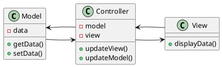
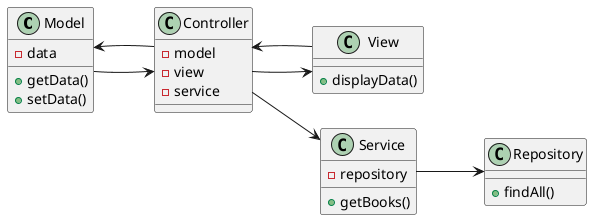

# TP2 : Projet MVC Swing Java

## Introduction

Dans ce TP, nous allons réaliser un projet Java en utilisant le pattern MVC (Modèle-Vue-Contrôleur) avec Swing pour l'interface graphique. Nous utiliserons Gradle avec Kotlin DSL pour la gestion du projet et des dépendances.

### Étape 1 : Initialisation du projet

Pour initialiser le projet, exécutez la commande suivante dans votre terminal :

```sh
gradle init --type java-application --dsl kotlin --test-framework junit --use-defaults --package "cpe.$($env:USERNAME).snake" --overwrite --project-name "Snake"
```

Cette commande initialise un projet Java avec Gradle en utilisant Kotlin DSL pour la configuration.

### Étape 2 : Configuration des dépendances

Modifiez le fichier `build.gradle.kts` pour ajouter les dépendances nécessaires :

```kotlin
dependencies {
    // Utilisation du framework de test JUnit.
    testImplementation(libs.junit)

    // Cette dépendance est utilisée par l'application.
    implementation(libs.guava)

    // Dépendance pour Spring Context.
    implementation("org.springframework:spring-context:6.2.3")
    
    // Dépendance pour JavaFX Swing.
    implementation("org.openjfx:javafx-swing:23")
}
```

### Théorie : Pattern MVC

Le pattern MVC sépare l'application en trois composants principaux :

- **Modèle** : Représente les données de l'application.
- **Vue** : Représente l'interface utilisateur.
- **Contrôleur** : Gère les interactions de l'utilisateur et met à jour le modèle et la vue.



Nous allons ajouter davantage de composants pour gérer les dépendances et les données de l'application.

Nous ajouterons plus tard un service et un repository pour gérer les données de l'application.



### Injection de dépendances

Dans l'exemple ci-dessus, il devient un peu pénible de créer un contrôleur, qui utilise un service, qui utilise un repository. Nous pouvons utiliser Spring pour injecter ces dépendances.

L'injection de dépendances permet de décorréler les composants de l'application. Un contrôleur peut accéder à un service et une vue sans les instancier lui-même, ce qui facilite les tests et la maintenance.

Nous utiliserons Spring Context pour gérer les dépendances.

### Étape 3 : Introduction à Spring Context et à l'injection de dépendances

Pour utiliser Spring Context dans le `main` pour lancer le projet, nous allons créer une classe principale qui initialise le contexte Spring et récupère le contrôleur pour démarrer l'application.

Vous allez voir des annotations comme `@Controller`, `@Service`, `@Repository`, `@Autowired`, `@Component`, `@Configuration`, `@ComponentScan`, etc.
Pour le moment, ne vous inquiétez pas de ces annotations, nous allons les voir en détail plus tard.

Modifiez votre classe `App.java` pour utiliser Spring Context :

```java
import org.springframework.context.ApplicationContext;
import org.springframework.context.annotation.AnnotationConfigApplicationContext;

public class MainApp {
    public static void main(String[] args) {
        var context = new AnnotationConfigApplicationContext(AppConfig.class);
        var controller = context.getBean(SimpleController.class);
        controller.showGreeting();
    }
}
```

> Pas de panique, cela ne compile pas à cette étape, il faut ajouter des fichiers !

Créez une classe `AppConfig` pour la configuration Spring :

```java
import org.springframework.context.annotation.ComponentScan;
import org.springframework.context.annotation.Configuration;

@Configuration
@ComponentScan(basePackages = "cpe.apicot.snake")
public class AppConfig {
}
```

Créez une classe `controller/MainController.java` :

```java
import org.springframework.beans.factory.annotation.Autowired;
import org.springframework.stereotype.Controller;

@Controller
public class MainController {
    @Autowired
    private MainView view;

    public void showGreeting() {
        view.displayGreeting("Bonjour");
    }
}
```

Créez une classe `views/MainView.java` :

```java
import org.springframework.stereotype.Component;
import javax.swing.*;

@Component
public class MainView {
    public void displayGreeting(String message) {
        JFrame frame = new JFrame("Greeting");
        JLabel label = new JLabel(message, SwingConstants.CENTER);
        frame.add(label);
        frame.setSize(200, 100);
        frame.setDefaultCloseOperation(JFrame.EXIT_ON_CLOSE);
        frame.setVisible(true);
    }
}
```

### Extraction de la chaîne "Bonjour" dans un service

Nous avons ainsi la base de notre MVC, cependant, le contrôleur se contente d'afficher "Bonjour". Un contrôleur est seulement censé gérer les interactions de l'utilisateur et de mettre à jour le modèle et la vue. Il ne devrait pas contenir de logique métier.

Donc si je vous demande d'afficher "Hello" au lieu de "Bonjour" en fonction de la langue, votre contrôleur va commencer à avoir trop de code.
Imaginez que le client, pénible, vous demande d'écrire "Bonjour", "Bonsoir", "Good Morning", "Good Afternoon".

Le réflexe est d'extraire le code dans une classe de service.
En entreprise, des outils permettent de le faire automatiquement, mais pour le TP vous allez le faire à la main.

Créez une classe `service/GreetingService` :

```java
import org.springframework.stereotype.Service;

@Service
public class GreetingService {
    public String getGreeting() {
        Locale locale = Locale.getDefault();
        LocalTime currentTime = LocalTime.now();
        String greeting;

        if (locale.getLanguage().equals("fr")) {
            if (currentTime.isBefore(LocalTime.NOON)) {
                greeting = "Bonjour";
            } else if (currentTime.isBefore(LocalTime.of(18, 0))) {
                greeting = "Bon après-midi";
            } else {
                greeting = "Bonsoir";
            }
        } else {
            if (currentTime.isBefore(LocalTime.NOON)) {
                greeting = "Good Morning";
            } else if (currentTime.isBefore(LocalTime.of(18, 0))) {
                greeting = "Good Afternoon";
            } else {
                greeting = "Good Evening";
            }
        }

        return greeting;
    }
}
```

Modifiez la classe `SimpleController` pour utiliser `GreetingService` :

```java
import org.springframework.beans.factory.annotation.Autowired;
import org.springframework.stereotype.Controller;

@Controller
public class SimpleController {
    @Autowired
    private SimpleView view;

    @Autowired
    private GreetingService greetingService;

    public void showGreeting() {
        String greeting = greetingService.getGreeting();
        view.displayGreeting(greeting);
    }
}
```

Avec ces modifications, vous avez maintenant un contrôleur simple qui affiche "Bonjour" en utilisant une vue injectée et un service pour gérer le message de salutation.

Remarquez le `@Service` sur la classe `GreetingService` et le `@Autowired` sur le champ `greetingService` dans la classe `SimpleController`. Ces annotations permettent à Spring de gérer les dépendances entre les composants de l'application.

Spring va automatiquement créer une instance de `GreetingService` et l'injecter dans `SimpleController` lors de la création du contexte Spring.

Et si le service avait besoin d'un autre service, par exemple la météo, pour afficher "Bonjour, il fait 14°C", la mise à jour va être très simple.

Si vous ne faites pas d'injection de dépendances, vous vous retrouvez avec quelque chose comme ça :

```java
new Controller(new View(), new GreetingService(new WeatherService()), new BookService(new InMemoryRepository()));
```

Avec Spring, pour créer une instance faites simplement :

```java
var controller = context.getBean(Controller.class);
```

Et tout est automatiquement injecté.

## Présentation du sujet

Le sujet s'intitule "Snake". Vous allez réaliser un jeu de serpent en utilisant le pattern MVC avec Swing pour l'interface graphique.

Le projet est inspiré d'un projet étudiant de l'an dernier.

C'est ce genre de projet que vous pourriez réaliser en binôme lors des prochains TPs.

L'enjeu est d'utiliser des Design Patterns pour rendre le code plus lisible, plus maintenable et plus évolutif.
Il est possible de coder le projet sans, mais les demandes itératives vous conduiront à adopter cette pratique.

### Fonctionnalités

- Le serpent se déplace dans une grille de 20x20 cases, mais ce nombre peut être modifié.
- Le serpent peut manger des fruits ou des bonbons, qui apparaissent aléatoirement dans la grille. Ils influent sur le gameplay, on utilisera le DP Décorateur pour cela.
  - Certains fruits augmentent la taille du serpent, d'autres diminuent la taille du serpent.
  - Les bonbons sont des bonus/malus temporaires.
- Par défaut, il ne peut pas se mordre sinon c'est GameOver, on implémentera d'autres modes de jeu grâce au DP Stratégie.
  - Par exemple, un mode où si l'on touche un bord on se téléporte de l'autre côté.
  - Ou alors des obstacles apparaissent dans la grille.
- La difficulté par défaut est juste qu'à un moment donné il n'y a plus de place sur la grille.
  - Toujours grâce au DP Stratégie, on pourra imaginer que la vitesse du serpent augmente avec le temps.
  - Ou encore un autre mode de jeu dans lequel, le serpent doit régulièrement manger pour ne pas mourir.

Dans un premier temps, on mettra en dur la configuration des modes de jeu, puis on pourra par exemple créer un menu, qui avec le DP Builder, permettra de sélectionner les modes de jeu.

Enfin, comme on découpe notre code en composants, il faut que la vue ou même d'autres services soient au courant des changements dans le jeu (bonus, seuil de points, obstacles, etc.). On utilisera le DP Observateur pour cela.

Vous voyez que les Design Patterns sont des outils qui permettent de rendre le code plus modulaire et plus évolutif.

L'enjeu est toujours d'avoir une version fonctionnelle, et de rajouter des fonctionnalités sans tout casser, il faut donc coder proprement pour avoir cette flexibilité.

## Implémentation

### Étape 1 : Création du modèle et modification de la vue et du contrôleur

Créez une classe `Snake` pour représenter le serpent :

```java
public class Snake {

    private final LinkedList<Point> body = new LinkedList<>();
    private Direction direction;
    private int maxSize;
    private int speed = 20;

    public int getSpeed() {
        return speed;
    }

    public void increaseSpeed() {
        if (speed < 20)
            speed++;
    }

    public Direction getDirection() {
        return direction;
    }

    public Point getHead() {
        // Return latest point in the queue
        return body.peek();
    }

    public Point getTail() {
        // Return oldest point in the queue
        return new LinkedList<>(body).getLast();
    }

    public Snake(Point head, int originalLength) {
        maxSize = originalLength;
        for (int i = 0; i < originalLength; i++) {
            body.add(head);
        }
        direction = Direction.values()[new java.util.Random().nextInt(Direction.values().length)];
    }

    public Collection<Point> getBody() {
        return body;
    }

    public void turn(Direction direction) {
        this.direction = direction;
    }

    public void move(Point newHead) {
        body.addFirst(newHead);
        if (body.size() > maxSize) {
            body.removeLast(); // Remove tail if size exceeds maxSize
        }
    }

    public void grow(int grow) {
        if (maxSize + grow < 1) {
            throw new IllegalArgumentException("Length must be positive");
        }

        maxSize += grow;

    }

}
```

- Côté UI, nous allons avoir différents types de cellules, nous allons donc créer l'enum `model/CellType` pour les différents types de cellules.

```java
public enum CellType {
    EMPTY(Color.WHITE),
    SNAKE(Color.BLACK),
    FRUIT(Color.RED),
    WALL(Color.GRAY),
    CANDY(Color.PINK);

    public Color color;

    CellType(Color color) {
        this.color = color;
    }
}
```

- Créez ensuite une classe abstraite `model/events/GameEvent` pour représenter les événements du jeu :
  (Mettez chaque classe dans un fichier séparé)

```java
public abstract class GameEvent {}
public class StartEvent extends GameEvent {}
public class MoveEvent extends GameEvent {
    public Integer playerId;
    public Point head;

    public MoveEvent(Integer playerId, Point head) {
        this.playerId = playerId;
        this.head = head;
    }
}
public class UpdateEvent extends GameEvent {}
```

Créez ensuite un `service/GameStateService` pour gérer l'état du jeu :

```java
@Service
public class GameStateService extends SubmissionPublisher<GameEvent> {

    private Map<Integer, Snake> snakes = new HashMap<>();
    private Map<Point, AbstractAliment> aliments = new HashMap<>();
    private boolean isPaused;
    private int boardWidth;
    private int boardHeight;

    public int getBoardWidth() {
        return boardWidth;
    }

    public int getBoardHeight() {
        return boardHeight;
    }

    public void initBoard(int x, int y) {
        boardWidth = x;
        boardHeight = y;
    }

    public CellType[][] getBoard() {
        var cells = new CellType[boardHeight][boardWidth];
        for (int i = 0; i < getBoardHeight(); i++) {
            for (int j = 0; j < getBoardWidth(); j++) {
                cells[i][j] = CellType.EMPTY;
            }
        }

        // Draw body of snake
        for (var s : snakes.values()) {
            for (var p : s.getBody()) {
                cells[p.y][p.x] = CellType.SNAKE;
            }
        }

        // Draw head of snake
        for (var s : snakes.values()) {
            Point head = s.getHead();
            cells[head.y][head.x] = CellType.SNAKE_HEAD;
        }
        return cells;
    }

    public void addSnake(Integer i, Snake s) {
        snakes.put(i, s);
    }

    public Snake getSnake(Integer i) {
        return snakes.get(i);
    }

    public Collection<Integer> getPlayers() {
        return snakes.keySet();
    }

}
```

> Notez que le service `GameStateService` étend `SubmissionPublisher<GameEvent>`. Cela signifie que `GameStateService` est un Publisher qui publie des événements de jeu.
> Concrètement, cela signifie que `GameStateService` peut envoyer des événements de jeu à d'autres composants de l'application.
> En l'occurrence, notre contrôleur appelle le service, mais le service lui ne peut pas appeler le contrôleur.
> Dans le cas de startGame, nous aurions juste pu l'appeler dans le contrôleur puis effectuer une action ensuite.

> Mais le principe est que le `GameStateService` fait sa vie, le contrôleur est prévenu des changements, et selon, il réagit.

> Ce qui est cool, c'est que là le jeu commence, on va donc juste afficher le serpent dans notre vue, mais vous pourriez très bien imaginer qu'un autre service lorsque le jeu commence, joue un son par exemple.

> <strong style="font-size: 1.5rem;"> Pour cela, il faut **s'abonner** au GameService, c'est le principe du DP Observateur.</strong>

```plantuml
class GameStateService extends Publisher
class MainController implements Subscriber

MainController -> GameStateService : 1. s'abonne aux changements
MainController -> GameStateService : 2. fait une action / récupère des données
GameStateService .> MainController : 3. prévient qu'il s'est passé un truc

MainController -left-> MainView : 4. affiche les données

```

Je vous donne une classe qui permet de s'abonner à un Publisher, et de réagir aux événements.

```java


import java.util.concurrent.Flow;
import java.util.concurrent.Flow.Subscriber;
import java.util.concurrent.Flow.Subscription;
import java.util.function.Consumer;

import cpe.apicot.snake.model.event.GameEvent;

public class Sub {

    // Private constructor to hide the implicit public one
    private Sub() {
    }

    public static <T extends GameEvent> Subscriber<GameEvent> get(Class<T> t, Consumer<T> consumer) {
        return new Flow.Subscriber<GameEvent>() {
            @Override
            public void onNext(GameEvent item) {
               //Get generic type of t


                if (t.isInstance(item)) {
                    consumer.accept(t.cast(item));
                }

            }

            @Override
            public void onSubscribe(Subscription subscription) {
                subscription.request(Long.MAX_VALUE);
            }

            @Override
            public void onError(Throwable throwable) {
                throwable.printStackTrace();
            }

            @Override
            public void onComplete() {
                System.out.println("Completed");
            }
        };
    }
}

```

Modifiez la classe `MainController` pour utiliser `GameService` et réagir aux événements du jeu :

> Je vous avais prévenu que le Java était verbeux, vous allez coller des bouts de code qui ne vous servent pas mais qui sont obligatoires.

```java

@Service
public class MainController {
    private final MainView view;
    private final GameService gameService;
    private final GreetingService greetingService;

    @Autowired
    public MainController(MainView view,
            GameService gameService,
            MovementService movementService,
            GameStateService stateService,
            GreetingService greetingService) {
        this.view = view;
        this.gameService = gameService;
        this.greetingService = greetingService;
        stateService.subscribe(Sub.get(UpdateEvent.class, e -> {
           view.rafraichirGrille(e.board);
        }));
        view.addKeyListener(new KeyAdapter() {
            @Override
            public void keyPressed(KeyEvent e) {
                // Gérer l'événement de touche enfoncée

                switch (e.getKeyCode()) {

                    case KeyEvent.VK_UP:
                        movementService.changeDirection(1, Direction.UP);
                        break;
                    case KeyEvent.VK_DOWN:
                        movementService.changeDirection(1, Direction.DOWN);
                        break;
                    case KeyEvent.VK_LEFT:
                        movementService.changeDirection(1, Direction.LEFT);
                        break;
                    case KeyEvent.VK_RIGHT:
                        movementService.changeDirection(1, Direction.RIGHT);
                        break;
                    default:
                        break;
                }
            }
        });

    }

    public void lancerJeu() {
        gameService.startGame();
    }
}


```

Et la vue :

```java


@Component
public class MainView {
    private SnakePanel grille = new SnakePanel();
    private JFrame frame;

    @Autowired
    public MainView() {
        frame = new JFrame("Snake Game");
        frame.setDefaultCloseOperation(JFrame.EXIT_ON_CLOSE);
        frame.setSize(800, 800);

        JPanel mainPanel = new JPanel(new FlowLayout());

        mainPanel.add(grille);
        frame.add(mainPanel);
        frame.setVisible(true);

        frame.setFocusable(true);
        frame.requestFocusInWindow();
    }

    public void rafraichirGrille(CellType[][] cells) {
        grille.setGrid(cells);

    }

    public void addKeyListener(KeyListener listener) {
        frame.addKeyListener(listener);
    }

}


```

Voici le code de `SnakePanel` :

```java


public class SnakePanel extends JPanel {
    public SnakePanel() {
        setPreferredSize(new Dimension(800, 800)); // Taille par défaut du panneau
    }
    private CellType[][] grid; // Le tableau des types de cellules

    // Méthode pour remplacer toute la grille
    public void setGrid(CellType[][] newGrid) {
        // Remplacer le contenu de la grille actuelle par la nouvelle
        this.grid = newGrid;
        repaint(); // Redessiner le panneau avec la nouvelle grille
    }

    @Override
    protected void paintComponent(Graphics g) {
        super.paintComponent(g);
        try {
            if (grid == null) {
                return;
            }
            // Calculer la taille des cellules (la plus petite dimension entre largeur et
            // hauteur du JPanel)
            int cellWidth = Math.min(getWidth(), getHeight()) / grid[0].length;
            int cellHeight = cellWidth; // Cellules carrées

            // Calculer l'espace gris autour (en fonction de la taille du JPanel et de la
            // grille)
            int gridWidth = grid[0].length * cellWidth;
            int gridHeight = grid.length * cellHeight;

            // Calculer l'espace gris à gauche et en haut pour centrer la grille
            int offsetX = (getWidth() - gridWidth) / 2;
            int offsetY = (getHeight() - gridHeight) / 2;

            // Remplir l'arrière-plan en gris
            g.setColor(Color.GRAY);
            g.fillRect(0, 0, getWidth(), getHeight()); // Fond gris sur tout l'écran

            // Dessiner chaque cellule dans la grille, en tenant compte du décalage pour
            // centrer
            for (int i = 0; i < grid.length; i++) {
                for (int j = 0; j < grid[i].length; j++) {
                    g.setColor(grid[i][j].color);
                    g.fillRect(offsetX + j * cellWidth, offsetY + i * cellHeight, cellWidth, cellHeight);
                }
            }

        } catch (Exception e) {
            System.out.println("Error in paintComponent: " + e.getMessage());
        }

    }
}

```

### Étape 2 : Ajout des fonctionnalités

Le projet est enfin initialisé, on va pouvoir commencer à coder les fonctionnalités.

Pour rappel, le contrôleur met à jour la vue, et le service met à jour le modèle.

Quand un changement intervient sans le GameStateService, d'autres services et/ou le contrôleur sont prévenus.

Nous allons voir comment utiliser le DP d'injection de dépendances et le DP Observateur au sein d'un nouveau service.

Créez une classe `service/GameService` pour lancer votre partie :

```java

@Service
public class GameService {
    private final GameStateService stateService;
    private final MovementService movementService;
    private final GameStateService gameStateService;

    @Autowired
    public GameService(GameStateService stateService) {
        this.stateService = stateService;
    }

    ScheduledExecutorService scheduler = Executors.newSingleThreadScheduledExecutor();
    public void startGame() {
        // Initialiser le plateau de jeu
        stateService.initBoard(20, 20);

        // Créer un serpent, un seul joueur pour le moment
        Snake snake = new Snake(new Point(10, 10), 3);

        // Nous sommes le joueur 1
        stateService.addSnake(1, snake);


        // toutes les 100ms on ordonne de mettre à jour le plateau
        scheduler.scheduleWithFixedDelay(()-> stateService.submit(new UpdateEvent()), 0, 100, java.util.concurrent.TimeUnit.MILLISECONDS);

        // On prévient que le jeu commence
        gameStateService.submit(new StartEvent());

    }


}

```

Pour le moment, on a un jeu qui se lance, et qui affiche un serpent qui ne bouge pas.

On va maintenant ajouter un service qui va gérer les déplacements du serpent.

Créez une classe `service/MovementService` pour gérer les déplacements du serpent :

```java

@Service
public class MovementService {
    protected GameStateService stateService;

    protected AbstractMovementService(GameStateService stateService) {
        this.stateService = stateService;
        this.stateService.subscribe(Sub.get(StartEvent.class, t -> start()));
    }
    @Override
    public void move(Integer i) {
        Snake s = stateService.getSnake(i);
        if (stateService.isPaused()) {
            return;
        }

        Direction direction = s.getDirection();
        Point head = s.getHead();
        Point newHead = new Point(head);
        switch (direction) {
            case UP:
                newHead.y--;
                break;
            case DOWN:
                newHead.y++;
                break;
            case LEFT:
                newHead.x--;
                break;
            case RIGHT:
                newHead.x++;
                break;
        }

        s.move(newHead);
        stateService.submit(new MoveEvent(i, newHead));
    }

    private void loop(int i) {
        int speed = stateService.getSnake(i).getSpeed();
        var delay = (int) (100 * Math.exp(-0.193 * (speed - 1)) + 150);
        move(i);
        scheduler.schedule(() -> loop(i), delay, TimeUnit.MILLISECONDS);
    }

    private void start() {
        for (Integer p : stateService.getPlayers()) {
            loop(p);
        }
    }

    public void changeDirection(int i, Direction newDirection) {
        var snake = stateService.getSnake(i);
        snake.turn(newDirection);
    }
}

```

Vous remarquez que votre service tourne en arrière-plan, et il gère le déplacement du serpent.

Lorsqu'il a fini, le state est mis à jour et on prévient les autres services.

Pour le moment seul le contrôleur est abonné, pour mettre à jour la vue.

### Étape 3 : Ajout des aliments

- Créez une classe abstraite `model/AbstractAliment` pour représenter les aliments du jeu :
- Créez une classe `model/Fruit` qui hérite de `AbstractAliment` pour représenter les fruits
- Créez une classe `model/Candy` qui hérite de `AbstractAliment` pour représenter les bonbons
- Dans `GameStateService`, ajoutez les aliments et quelques méthodes qui encapsulent les actions sur les aliments

  ```plantuml
  class GameStateService {
      + addAliment(Point, AbstractAliment)
      + removeAliment(Point)
      + getAliment(Point)
      - aliments: Map<Point, AbstractAliment>

  }
  ```

- Modifiez la méthode `getBoard` pour dessiner les aliments sur la grille.

- Créez un service `service/AlimentService` pour gérer les aliments :

  - Le constructeur de `AlimentService` injecte `GameStateService`, puis il s'abonne à l'événement `StartEvent` pour lancer la génération aléatoire des aliments.
  - En outre il s'abonne à l'événement `MoveEvent` pour vérifier si le serpent a mangé un aliment.
  - Pour la génération aléatoire des aliments, vous pouvez utiliser le scheduler pour générer un fruit toutes les secondes par exemple.

    ```java
    scheduler.scheduleWithFixedDelay(this::popAliment, 1000, 1000, java.util.concurrent.TimeUnit.MILLISECONDS);
    ```

  - Dans popAliment, vous prenez une position aléatoire, et vous ajoutez un fruit ou un bonbon.
  - Si un serpent mange un aliment, vous pouvez :
    - Augmenter la taille du serpent de 3 si c'est un fruit
    - Augmenter la vitesse du serpent de 1 si c'est un bonbon
    - Augmenter le score dans le GameStateService de 1 ou 5 selon le type d'aliment
    - Pensez à supprimer l'aliment du GameStateService

- En bonus, nous avons vu que le scheduler permet de planifier des tâches dans le futur, vous pouvez imaginer un mode de jeu où les fruits disparaissent au bout de 10 secondes par exemple.

```java
scheduler.schedule(
    () -> stateService.getAliment(point)
          .ifPresent(e -> stateService.removeAliment(point)),
    aliment instanceof Fruit ? 8 : 5,
    java.util.concurrent.TimeUnit.SECONDS);
```

### Étape 4 : Ajout des obstacles

- Créez une classe `model/Obstacle` pour représenter les obstacles
- Modifiez la méthode `getBoard` pour dessiner les obstacles sur la grille
- Créez un service `ObstacleService` pour gérer les obstacles :
  - Le constructeur de `ObstacleService` injecte `GameStateService`, puis il s'abonne à l'événement `StartEvent` pour lancer la génération aléatoire des obstacles
  - Pour la génération aléatoire des obstacles, vous pouvez utiliser le scheduler pour générer un obstacle toutes les 5 secondes par exemple
  - Dans `popObstacle`, vous prenez une position aléatoire, et vous ajoutez un obstacle
  - Si un serpent touche un obstacle, vous pouvez :
    - Diminuer la taille du serpent de 3
    - Diminuer la vitesse du serpent de 1
    - Diminuer le score dans le GameStateService de 1
    - Pensez à supprimer l'obstacle du GameStateService
  - Pensez à faire disparaître les obstacles au bout de quelques secondes.

### Étape 5 : Ajout des murs

- Créez une classe `model/Wall` pour représenter les murs, celle-ci hérite de `Obstacle`
- Modifiez la méthode `getBoard` pour dessiner les murs sur la grille
- Modifier votre ObstacleService pour générer des murs une seule fois au début du jeu
- Modifiez la manière dont vous réagissez aux collisions avec un obstacle.
  - Les obstacles font perdre des points, mais ne tuent pas le serpent
  - Les murs tuent le serpent
  - Utilisez `instanceof` pour distinguer les murs des autres obstacles
- vous devriez rajouter un événement `GameOverEvent` pour prévenir que le jeu est terminé.
    - Abonnez vous à cet événement pour afficher une popup dans le contrôleur via la vue, arrêter les différents Schedulers, etc.


### Étape 6 : Modification du comportement des aliments

On souhaite que les bonbons aient un effet temporaire, soyez créatif !
Par exemple, le serpent pourrait ne plus grossir pendant 10 secondes, ou bien il pourrait se déplacer plus vite, ou bien il pourrait être invincible pendant 5 secondes.

Pour cela on va utiliser le DP Commande.
De cette manière les effets seront combinables et on aura une méthode pour les appliquer et les enlever à l'issue du temps.

Nous allons donc créer pas mal de classes filles de `Bonbon` pour les différents effets, on en profitera pour créer des fruits qui eux ont des effets permanents.

Par exemple

```plantuml
interface IEffet {
    + appliquer(GameStateService, playerId)
    + enlever(GameStateService, playerId)
}

abstract class AbstractAliment implements IEffet {}
abstract class Fruit extends AbstractAliment  {

    + enlever(GameStateService, playerId)

}
abstract class Bonbon extends AbstractAliment {
}
class SpeedBonbon extends Bonbon {
    + appliquer(GameStateService, playerId)
    + enlever(GameStateService, playerId)
}

class InvincibleBonbon extends Bonbon {
    + appliquer(GameStateService, playerId)
    + enlever(GameStateService, playerId)
}
class Banana extends Fruit {
    + appliquer(GameStateService, playerId)
}

```

Pour la mise en place du DP Commande, vous pouvez vous inspirer de ce code :

```java

public class SpeedBonbon extends Bonbon {
    private final Bonbon bonbon;

    public SpeedBonbon(Bonbon bonbon) {
        this.bonbon = bonbon;
    }

    @Override
    public void appliquer(GameStateService stateService, Integer playerId) {
        stateService.getSnake(playerId).increaseSpeed();
    }

    @Override
    public void enlever(GameStateService stateService, Integer playerId) {
        stateService.getSnake(playerId).decrease();
    }
}

```

Puis dans votre `AlimentService` vous pouvez ajouter des bonbons avec des effets.

```java

public class AlimentService {


    public void ingererAliment(Point point, Integer playerId) {
        var aliment = stateService.getAliment(point);
        if (aliment.isEmpty()) {
            return;
        }
        var a = aliment.get();
        stateService.appliquerEffet(a, playerId);
        stateService.removeAliment(point);
        scheduler.schedule(() -> stateService.enleverEffet(a, playerId), 5, java.util.concurrent.TimeUnit.SECONDS);
    }

}

```

Dans votre `GameStateService` vous pouvez ajouter les méthodes `appliquerEffet` et `enleverEffet`.

```java

public void appliquerEffet(AbstractAliment a, Integer playerId) {
    a.appliquer(this, playerId);
}

public void enleverEffet(AbstractAliment a, Integer playerId) {
    a.enlever(this, playerId);
}

```


- Faites évoluer vos aliments pour leur donner une couleur différente et définir la durée de l'effet pour les bonbons.
- Vous pouvez essayer de dessiner des émojis : 
 🍬 🍭 🍉 🍇 🍓 🍒 🍑 🍍 🥭 🥝 🥥 🥑 🍏 🍎 🍐 🍊 🍋 🍈 🥮 🍢 🍡 🍧 🍨 🍦 🥧 🧁 🍰 🎂 🍮 🍭 🍬 🍫 
- Vous pouvez dans la méthode appliquerEffet alimenter une liste de bonus actifs, et dans la méthode enleverEffet, supprimer le bonus de la liste.
    - Profitez en pour émettre un événement à chaque fois qu'un bonus est ajouté ou enlevé, et abonnez votre contrôleur pour afficher les bonus actifs.
    - Vous pouvez en dessous de la grille afficher les bonus actifs.
    - Vous pourriez créer un SoundService qui s'abonne à l'événement de bonus ajouté, et qui joue un son.
    - Vos bonus ne modifient que le GameStateservice, mais grâce au DP Observateur, dans MovementService, vous pouvez réagir à l'ajout ou l'expiration d'un bonus.
        - Par exemple si vous créez un aliment négatif, vous pourriez faire en sorte que le serpent se déplace dans le sens inverse.

### Étape 7 : Implémenter un système de score

- Créez une classe `model/Score` pour représenter le score du joueur
- Créez une classe `service/ScoreService` pour gérer le score du joueur
- Abonnez vous à des événements pour augmenter ou diminuer le score
    - Par exemple stockez le nombre de fruits mangés, et le nombre de bonbons mangés
    - Vous pouvez aussi stocker le nombre d'obstacles touchés
    - Utilisez un scheduler pour augmenter le score toutes les secondes par exemple
- Modifiez votre vue et votre controleur pour afficher le score du joueur

### Étape 8 : Mise en pause du jeu

- Implémentez un système de pause pour le jeu
- Le joueur peut mettre en pause le jeu en appuyant sur la touche <kbd>Échap</kbd>
- Créez un événement `PauseEvent` pour prévenir que le jeu est en pause
- Créez un événement `ResumeEvent` pour prévenir que le jeu reprend
- Dans le `GameStateService`, ajoutez un champ `isPaused` pour savoir si le jeu est en pause
    - Dans le constructeur de ce dernier, vous pouvez vous abonner à l'événement `PauseEvent` pour mettre le jeu en pause, et à l'événement `ResumeEvent` pour reprendre le jeu afin d'alimenter votre champ `isPaused`
- Modifiez votre `MovementService` pour ne pas bouger le serpent si le jeu est en pause
- Cherchez sur internet ou sur votre IA préférée des idées pour afficher un écran de pause, pour le moment il sera vide, mais prévoyez que plus tard nous allons mettre des options !


### Étape 9 : DP Stratégie

#### Présentation 

Nous avons fait des choix arbitraires pour le moment, vous avez sûrement des idées originales pour rendre le jeu plus intéressant, mais vous ne savez pas laquelle choisir.

Pour cela, vous pouvez utiliser le DP Stratégie.

Le concept est le suivant : 

- Vous utilisez les touches fléchées pour diriger le serpent, mais peut-être que vous préféreriez utiliser les touches ZQSD, ou encore le déplacement de la souris, voire à la manette.
- Les aliments apparaissent de manière aléatoire, peut-être que vous préféreriez qu'ils apparaissent uniquement sur les bords à l'opposé du serpent.
- Dans votre ScoreService, on gagne 1 point par secondes, mais peut-être que vous voudriez augmenter le score en fonction de la taille du serpent, ou en fonction du temps de jeu.
    - Exemple le score += gameStateService.getSnake(playerId).getBody().size() * 10;
    - Ou encore score += 5 * Math.exp(0.01 * x) 


Il est temps de créer des stratégies pour gérer ces comportements.
Chacun de nos services est une classe concrète qui n'hérite de rien et n'implémente pas spécialement d'interface.

Actuellement, votre contrôleur fait la translation entre les touches et la direction 

```java
view.addKeyListener(new KeyAdapter() {
            @Override
            public void keyPressed(KeyEvent e) {
                // Gérer l'événement de touche enfoncée

                switch (e.getKeyCode()) {

                    case KeyEvent.VK_UP:
                        movementService.changeDirection(1, Direction.UP);
                        break;
                    case KeyEvent.VK_DOWN:
                        movementService.changeDirection(1, Direction.DOWN);
                        break;
                    case KeyEvent.VK_LEFT:
                        movementService.changeDirection(1, Direction.LEFT);
                        break;
                    case KeyEvent.VK_RIGHT:
                        movementService.changeDirection(1, Direction.RIGHT);
                        break;
                    default:
                        break;
                }
            }
        });
```

- Changez ceci, pour que l'on passe le `KeyCode` au mouvementService, et que le mouvementService s'occupe de la traduction.
(Il faut juste déplacer du code)

Reprenons notre MovementService :

```plantuml 

class MovementService {
    + move(int player)
    + changeDirection(int player, int keyCode)
}

```

Refactorisez votre code ainsi : 

```plantuml
interface IMovementService {
    + move(int player)
    + changeDirection(int player, int keyCode)
}
abstract class AbstractMovementService implements IMovementService {
    + move(int player)
    + abstract changeDirection(int player, int keyCode)
}
class ArrowKeyMovementService extends AbstractMovementService {
    + changeDirection(int player, int keyCode)
}
class ZQSDMovementService extends AbstractMovementService {
    + changeDirection(int player, int keyCode)
}

```

> Conseil : 
Depuis votre IDE vous pouvez faire un clic droit sur uen méthode et faire Refactor > Extract Interface pour créer l'interface IMovementService.

Nous avons introduit une classe abstraite `AbstractMovementService` qui implémente l'interface `IMovementService`, et qui contient une méthode abstraite `changeDirection`, la méthode `move` est commune à tous les services.
Nous avons ensuite créé deux classes filles `ArrowKeyMovementService` et `ZQSDMovementService` qui héritent de `AbstractMovementService` et qui implémentent la méthode `changeDirection` (la méthode `move` est héritée de `AbstractMovementService`).

**Il serait intéressant de pouvoir changer de stratégie en cours de jeu, le DP Stratégie permet de le faire.**

#### Mise en place du DP Stratégie avec Spring Context

Nos classes ont l'annotation `@Service`, nous allons changer cela pour utiliser l'annotation `@Component`.

```java
@Component
public class ZQSDKeyMovementService extends AbstractMovementService {
    @Autowired
    public ZQSDKeyMovementService(GameStateService stateService) {
        super(stateService);

    }
    @Override
    public void changeDirection(int i, int keyCode) {
        var snake = stateService.getSnake(i);
        Direction newDirection ;
        switch (keyCode) {
            case KeyEvent.VK_Z:
               newDirection = Direction.UP;
            break;
            case KeyEvent.VK_S:
                newDirection = Direction.DOWN;
            break;
            case KeyEvent.VK_Q:
                newDirection = Direction.LEFT;
            break;
            case KeyEvent.VK_D:
                newDirection = Direction.RIGHT;
            break;

            default:
                return;
        }
        if (newDirection == snake.getDirection()) {
            return;
        }
        snake.turn(newDirection);
    }
   

}

```

```java
@Component
public class ArrowKeyMovementService extends AbstractMovementService {
    @Autowired
    public ArrowKeyMovementService(GameStateService stateService) {
        super(stateService);

    }
    @Override
    public void changeDirection(int i, int keyCode) {
        var snake = stateService.getSnake(i);
        Direction newDirection ;
        switch (keyCode) {
            case KeyEvent.VK_UP:
               newDirection = Direction.UP;
            break;
            case KeyEvent.VK_DOWN:
                newDirection = Direction.DOWN;
            break;
            case KeyEvent.VK_LEFT:
                newDirection = Direction.LEFT;
            break;
            case KeyEvent.VK_RIGHT:
                newDirection = Direction.RIGHT;
            break;
            default:
                return;
        }
        if (newDirection == snake.getDirection()) {
            return;
        }
        snake.turn(newDirection);
    }
   

}

```

- Créez un `service/GameOptionsService` pour gérer les options du jeu, et injectez les différentes stratégies.

```java
import cpe.apicot.snake.service.movement.IMovementService;

@Service
public class GameOptionsService {
    private final ApplicationContext context;
    private final GameService gameService;

    @Autowired
    public GameOptionsService(ApplicationContext context, GameService gameService) {
        this.context = context;
        this.gameService = gameService;
    }

    public void setMovementStrategy(Class<? extends IMovementService> strategy) {
        gameService.pauseGame();
        var autowireCapableBeanFactory = context.getAutowireCapableBeanFactory();
        var oldMovementService = gameService.getMovementService();
        if (oldMovementService != null) {
            context.getAutowireCapableBeanFactory().destroyBean(oldMovementService);
        }
        IMovementService newMovementService = autowireCapableBeanFactory.createBean(strategy);
        gameService.setMovementService(newMovementService);
        gameService.resumeGame();   
    }
}
```


- Nous allons stocker la stratégie actuelle dans le `GameStateService` :
```java
@Service
public class GameService {
    private IMovementService movementService;
    final GameStateService stateService;

    @Autowired
    public GameService(IMovementService movementService,
            GameStateService stateService) {
        this.movementService = movementService;
        this.stateService = stateService;
    }

    public IMovementService getMovementService() {
        return movementService;
    }

    public void setMovementService(IMovementService movementService) {
        this.movementService = movementService;
    }
}
```
    
- Normalement votre projet ne devrait plus fonctionner à cette étape, en effet on demande un `IMovementService` mais on a deux classes filles, il faut donc préciser laquelle on veut utiliser.
Pour cela, on va utiliser l'annotation `@Primary` sur une des classes filles.
- En outre, on rajoute `@Lazy` sur chaque stratégie afin de n'instancier que celle qui est nécessaire

```java
@Component
@Primary
public class ArrowKeyMovementService extends AbstractMovementService 
```


- Modifiez votre `MainController` pour utiliser `GameOptionsService` :

```java
@Service
public class MainController {
    private final MainView view;
    private final GameService gameService;
    private final GameOptionsService gameOptionsService;

    @Autowired
    public MainController(MainView view,
            GameService gameService,
            MovementService movementService,
            GameStateService stateService,
            GameOptionsService gameOptionsService) {
        this.view = view;
        this.gameService = gameService;
        this.gameOptionsService = gameOptionsService;
        stateService.subscribe(Sub.get(UpdateEvent.class, e -> {
           view.rafraichirGrille(e.board);
        }));
        view.addKeyListener(new KeyAdapter() {
            @Override
            public void keyPressed(KeyEvent e) {
                // Gérer l'événement de touche enfoncée
                gameService.getMovementService().changeDirection(1, e.getKeyCode());
            }
        });

    }

    public void lancerJeu() {
        gameService.startGame();
    }
}
```

- Rajouter que dans votre `keyPressed`, si on tape sur la touche `M`, on change de stratégie.

```java
if (e.getKeyCode() == KeyEvent.VK_M) {
    if(gameService.getMovementService() instanceof ArrowKeyMovementService)
        gameOptionsService.setMovementStrategy(ZqsdKeyMovementService.class);
    else
        gameOptionsService.setMovementStrategy(ArrowKeyMovementService.class);
}
```

#### Bonus : Implémenter le dash

- Dans changeDirection, si le joueur va dans la même direction, on ne fait rien : 

```java 
if (newDirection == snake.getDirection()) {
    return;
}
```

- Vous pouvez remplacer par le code suivant afin de faire deux déplacements en un : 

```java
if (newDirection == snake.getDirection()) {
    scheduler.submit(() -> move(i));
}
```

**Ne l'implémentez pas si vous manquez de temps**, mais vous comprenez que vous pourriez encore faire une stratégie couplée avec une commande pour faire deux DP en un :

```plantuml
class MovementService extends AbstractMovementService {
    - IDashStrategy dashStrategy
    + changeDirection(int player, int keyCode)
}
interface IDashStrategy {
    + Consumer<IMovementService> onDash(int player, Direction direction)
}
class DashStrategyMoveFaster implements IDashStrategy {
    + Consumer<IMovementService> onDash(int player, Direction direction)
}
class DashStrategyTeleport implements IDashStrategy {
    + Consumer<IMovementService> onDash(int player, Direction direction)
}
class DashStrategyNothing implements IDashStrategy {
    + Consumer<IMovementService> onDash(int player, Direction direction)
}

MovementService *-right-> IDashStrategy

```

Ce qui nous donnerait par exemple : 

```java
@Lazy
@Component
@Primary
public class DashStrategyTeleport implements IDashStrategy {
    @Override
    public Consumer<IMovementService> onDash(int player, Direction direction) {
        return movementService -> {
            var snake = stateService.getSnake(player);
            Point head = snake.getHead();
            Point newHead = new Point(head);
            //TODO vérifier que si on téléporte de 3 case on se retrouve pas de l'autre côté du mur
            snake.translateAllBody(direction, 3);
            stateService.submit(new MoveEvent(player, newHead));
        };
    }
}

```

Ainsi vous pourriez choisir dans le menu option si vous souhaitez activer les dashs ou non (Stratégie) et votre Stratégie renvoie un Consumer qui sera exécuté dans le `MovementService`, c'est le DP Commande.

```java
//Dans votre movement service
if(newDirection == snake.getDirection()) {
    dashStrategy.onDash(i, newDirection).accept(this);
}
```


